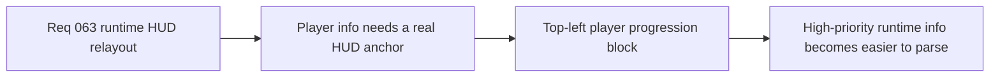

## item_238_define_a_compact_top_left_player_progression_hud_block - Define a compact top-left player progression HUD block
> From version: 0.4.0
> Status: Draft
> Understanding: 99%
> Confidence: 98%
> Progress: 0%
> Complexity: Medium
> Theme: UI
> Reminder: Update status/understanding/confidence/progress and linked task references when you edit this doc.

# Problem
- The current runtime feedback does not anchor player/progression information as a compact HUD cluster.
- The highest-priority combat information needs a more screen-native home.

# Scope
- In: a compact top-left block for `Name`, `Level`, `HP`, `XP`, and `Gold`.
- In: techno-shinobi HUD posture.
- Out: broader shell-wide redesign.

# Acceptance criteria
- AC1: The slice defines a compact top-left player/progression HUD block.
- AC2: The slice includes `Gold` in this block.
- AC3: The slice stays aligned with the techno-shinobi HUD language and should explicitly use `logics-ui-steering`.

# Links
- Product brief(s): `prod_013_techno_shinobi_runtime_hud_and_menu_entry_direction`
- Architecture decision(s): `adr_044_split_runtime_hud_into_anchored_blocks_and_route_mobile_menu_entry_to_the_full_screen_shell_surface`
- Request: `req_063_define_a_techno_shinobi_runtime_hud_relayout_and_mobile_menu_entry_wave`

# Notes
- Derived from request `req_063_define_a_techno_shinobi_runtime_hud_relayout_and_mobile_menu_entry_wave`.
