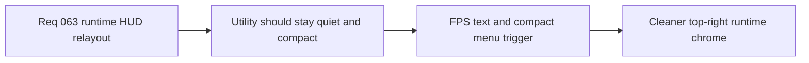

## item_239_define_a_quiet_top_right_fps_text_and_compact_runtime_menu_trigger - Define a quiet top-right FPS text and compact runtime menu trigger
> From version: 0.4.0
> Status: Draft
> Understanding: 99%
> Confidence: 98%
> Progress: 0%
> Complexity: Medium
> Theme: UI
> Reminder: Update status/understanding/confidence/progress and linked task references when you edit this doc.

# Problem
- `FPS` currently competes too much with core player information.
- The runtime menu trigger is visually too large for HUD chrome.

# Scope
- In: a quiet top-right `FPS` read.
- In: a more compact runtime menu trigger.
- Out: full command-deck redesign in the same slice.

# Acceptance criteria
- AC1: The slice defines `FPS` as quiet top-right text.
- AC2: The slice defines a more compact runtime menu trigger.
- AC3: The slice keeps the result aligned with the techno-shinobi HUD language and should explicitly use `logics-ui-steering`.

# Links
- Product brief(s): `prod_013_techno_shinobi_runtime_hud_and_menu_entry_direction`
- Architecture decision(s): `adr_044_split_runtime_hud_into_anchored_blocks_and_route_mobile_menu_entry_to_the_full_screen_shell_surface`
- Request: `req_063_define_a_techno_shinobi_runtime_hud_relayout_and_mobile_menu_entry_wave`

# Notes
- Derived from request `req_063_define_a_techno_shinobi_runtime_hud_relayout_and_mobile_menu_entry_wave`.
