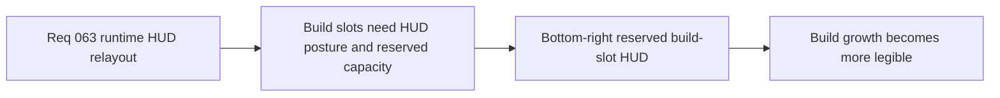

## item_240_define_a_bottom_right_reserved_build_slot_hud_for_active_and_passive_capacity - Define a bottom-right reserved build-slot HUD for active and passive capacity
> From version: 0.4.0
> Status: Done
> Understanding: 100%
> Confidence: 98%
> Progress: 100%
> Complexity: High
> Theme: UI
> Reminder: Update status/understanding/confidence/progress and linked task references when you edit this doc.

# Problem
- The current runtime feedback presents skills more like text rows than HUD slots.
- The HUD does not yet teach remaining build capacity through reserved empty positions.

# Scope
- In: a bottom-right build-slot HUD.
- In: one reserved row for actives and one for passives.
- In: slot visibility even when some slots are empty.
- Out: final bespoke icon art for every slot.

# Acceptance criteria
- AC1: The slice defines a compact bottom-right build-slot HUD.
- AC2: The slice reserves visible slot space for both active and passive capacity.
- AC3: The slice uses an icon-first plus level-badge posture by default and should explicitly use `logics-ui-steering`.

# Links
- Product brief(s): `prod_013_techno_shinobi_runtime_hud_and_menu_entry_direction`
- Architecture decision(s): `adr_044_split_runtime_hud_into_anchored_blocks_and_route_mobile_menu_entry_to_the_full_screen_shell_surface`
- Request: `req_063_define_a_techno_shinobi_runtime_hud_relayout_and_mobile_menu_entry_wave`

# Notes
- Derived from request `req_063_define_a_techno_shinobi_runtime_hud_relayout_and_mobile_menu_entry_wave`.
