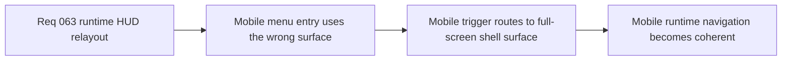

## item_241_route_the_mobile_runtime_menu_trigger_to_the_full_screen_shell_surface - Route the mobile runtime menu trigger to the full-screen shell surface
> From version: 0.4.0
> Status: Draft
> Understanding: 99%
> Confidence: 98%
> Progress: 0%
> Complexity: Medium
> Theme: UX
> Reminder: Update status/understanding/confidence/progress and linked task references when you edit this doc.

# Problem
- On mobile, the runtime menu trigger currently opens the floating deck model.
- That interaction model is weaker than a full-screen shell entry surface.

# Scope
- In: mobile-only routing of the runtime menu trigger to the full-screen shell surface.
- In: preserving desktop behavior where appropriate.
- Out: broad shell navigation redesign.

# Acceptance criteria
- AC1: The slice defines mobile routing into the full-screen shell surface.
- AC2: The slice preserves a coherent desktop/mobile split.
- AC3: The slice should explicitly use `logics-ui-steering` for the resulting shell behavior review.

# Links
- Product brief(s): `prod_013_techno_shinobi_runtime_hud_and_menu_entry_direction`
- Architecture decision(s): `adr_044_split_runtime_hud_into_anchored_blocks_and_route_mobile_menu_entry_to_the_full_screen_shell_surface`
- Request: `req_063_define_a_techno_shinobi_runtime_hud_relayout_and_mobile_menu_entry_wave`

# Notes
- Derived from request `req_063_define_a_techno_shinobi_runtime_hud_relayout_and_mobile_menu_entry_wave`.
