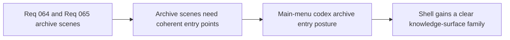

## item_243_define_main_menu_codex_archive_entry_posture_for_grimoire_and_bestiary_access - Define main-menu codex archive entry posture for grimoire and bestiary access
> From version: 0.4.0
> Status: Draft
> Understanding: 99%
> Confidence: 98%
> Progress: 0%
> Complexity: Medium
> Theme: UI
> Reminder: Update status/understanding/confidence/progress and linked task references when you edit this doc.

# Problem
- `Grimoire` and `Bestiary` need clear shell entry points.
- The main menu needs a coherent codex/archive posture rather than ad hoc extra buttons.

# Scope
- In: main-menu entry posture for both archive scenes.
- In: codex-family positioning and naming clarity.
- Out: full implementation of archive content itself.

# Acceptance criteria
- AC1: The slice defines coherent main-menu entry posture for `Grimoire` and `Bestiary`.
- AC2: The slice keeps both scenes legible as sibling archive surfaces.
- AC3: The slice should explicitly use `logics-ui-steering` for shell-entry presentation.

# Links
- Product brief(s): `prod_014_shell_codex_archive_direction_for_grimoire_and_bestiary`
- Architecture decision(s): `adr_045_model_grimoire_and_bestiary_as_shell_owned_discovery_gated_archive_scenes`
- Request: `req_064_define_a_grimoire_scene_for_skill_discovery_and_future_unlock_gating`, `req_065_define_a_bestiary_scene_for_discovered_and_defeated_creatures`

# Notes
- Derived from requests `req_064_define_a_grimoire_scene_for_skill_discovery_and_future_unlock_gating` and `req_065_define_a_bestiary_scene_for_discovered_and_defeated_creatures`.
