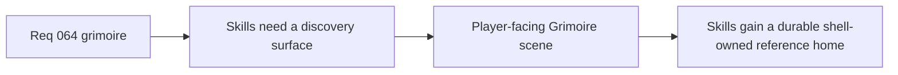

## item_244_define_a_player_facing_grimoire_scene_for_skill_discovery_and_future_unlock_gating - Define a player-facing grimoire scene for skill discovery and future unlock gating
> From version: 0.4.0
> Status: Draft
> Understanding: 99%
> Confidence: 98%
> Progress: 0%
> Complexity: Medium
> Theme: UI
> Reminder: Update status/understanding/confidence/progress and linked task references when you edit this doc.

# Problem
- The shell lacks a stable knowledge surface for skills.
- Future skill-discovery gating has no obvious player-facing home.

# Scope
- In: a dedicated `Grimoire` scene for skill reference.
- In: player-readable skill grouping and explanation.
- Out: equipment, tuning, or loadout management.

# Acceptance criteria
- AC1: The slice defines a player-facing `Grimoire` scene.
- AC2: The slice structures skills in a readable reference format.
- AC3: The slice keeps future unlock gating compatible and should explicitly use `logics-ui-steering`.

# Links
- Product brief(s): `prod_014_shell_codex_archive_direction_for_grimoire_and_bestiary`
- Architecture decision(s): `adr_045_model_grimoire_and_bestiary_as_shell_owned_discovery_gated_archive_scenes`
- Request: `req_064_define_a_grimoire_scene_for_skill_discovery_and_future_unlock_gating`

# Notes
- Derived from request `req_064_define_a_grimoire_scene_for_skill_discovery_and_future_unlock_gating`.
