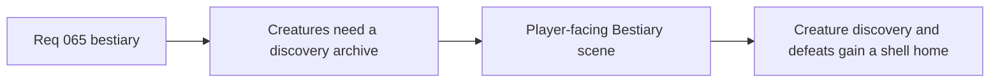

## item_245_define_a_player_facing_bestiary_scene_for_discovered_creatures_and_defeat_tracking - Define a player-facing bestiary scene for discovered creatures and defeat tracking
> From version: 0.4.0
> Status: Done
> Understanding: 100%
> Confidence: 98%
> Progress: 100%
> Complexity: Medium
> Theme: UI
> Reminder: Update status/understanding/confidence/progress and linked task references when you edit this doc.

# Problem
- The shell lacks a creature archive.
- Encounter and defeat tracking currently has no player-facing codex surface.

# Scope
- In: a dedicated `Bestiary` scene.
- In: discovered-creature visibility plus defeat counts.
- Out: full lore encyclopedia or analytics expansion.

# Acceptance criteria
- AC1: The slice defines a player-facing `Bestiary` scene.
- AC2: The slice supports discovered-creature visibility and defeat counts.
- AC3: The slice keeps future richer creature knowledge compatible and should explicitly use `logics-ui-steering`.

# Links
- Product brief(s): `prod_014_shell_codex_archive_direction_for_grimoire_and_bestiary`
- Architecture decision(s): `adr_045_model_grimoire_and_bestiary_as_shell_owned_discovery_gated_archive_scenes`
- Request: `req_065_define_a_bestiary_scene_for_discovered_and_defeated_creatures`

# Notes
- Derived from request `req_065_define_a_bestiary_scene_for_discovered_and_defeated_creatures`.
