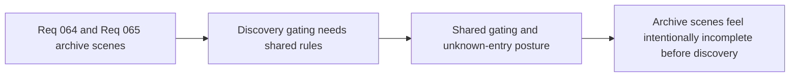

## item_246_define_a_shared_discovery_gating_and_unknown_entry_posture_for_codex_archive_scenes - Define a shared discovery gating and unknown-entry posture for codex archive scenes
> From version: 0.4.0
> Status: Done
> Understanding: 100%
> Confidence: 98%
> Progress: 100%
> Complexity: Medium
> Theme: UX
> Reminder: Update status/understanding/confidence/progress and linked task references when you edit this doc.

# Problem
- Both `Grimoire` and `Bestiary` need a coherent discovery-gating model.
- Unknown entries must feel intentional, not broken or missing.

# Scope
- In: shared posture for discovered versus undiscovered entries.
- In: unknown-entry hints, placeholders, or redaction strategy.
- Out: every future unlock rule in the same slice.

# Acceptance criteria
- AC1: The slice defines a shared discovery-gating posture for codex archive scenes.
- AC2: The slice defines an intentional unknown-entry posture.
- AC3: The slice remains compatible with future unlock expansion.

# Links
- Product brief(s): `prod_014_shell_codex_archive_direction_for_grimoire_and_bestiary`
- Architecture decision(s): `adr_045_model_grimoire_and_bestiary_as_shell_owned_discovery_gated_archive_scenes`
- Request: `req_064_define_a_grimoire_scene_for_skill_discovery_and_future_unlock_gating`, `req_065_define_a_bestiary_scene_for_discovered_and_defeated_creatures`

# Notes
- Derived from requests `req_064_define_a_grimoire_scene_for_skill_discovery_and_future_unlock_gating` and `req_065_define_a_bestiary_scene_for_discovered_and_defeated_creatures`.
