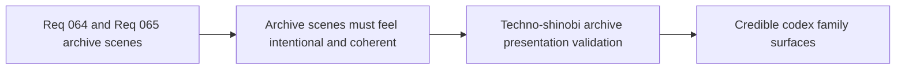

## item_247_define_techno_shinobi_codex_archive_presentation_and_validation_for_grimoire_and_bestiary - Define techno-shinobi codex archive presentation and validation for grimoire and bestiary
> From version: 0.4.0
> Status: Done
> Understanding: 100%
> Confidence: 98%
> Progress: 100%
> Complexity: Medium
> Theme: Quality
> Reminder: Update status/understanding/confidence/progress and linked task references when you edit this doc.

# Problem
- Archive scenes can easily become generic lists or overly text-heavy utilities.
- The codex family needs shared presentation validation.

# Scope
- In: presentation and readability validation for `Grimoire` and `Bestiary`.
- In: explicit `logics-ui-steering` review posture.
- Out: wider shell visual audit beyond these archive scenes.

# Acceptance criteria
- AC1: The slice defines validation for codex-family readability and coherence.
- AC2: The slice explicitly includes `logics-ui-steering`.
- AC3: The slice covers both discovered and undiscovered entry states.

# Links
- Product brief(s): `prod_014_shell_codex_archive_direction_for_grimoire_and_bestiary`
- Architecture decision(s): `adr_045_model_grimoire_and_bestiary_as_shell_owned_discovery_gated_archive_scenes`
- Request: `req_064_define_a_grimoire_scene_for_skill_discovery_and_future_unlock_gating`, `req_065_define_a_bestiary_scene_for_discovered_and_defeated_creatures`

# Notes
- Derived from requests `req_064_define_a_grimoire_scene_for_skill_discovery_and_future_unlock_gating` and `req_065_define_a_bestiary_scene_for_discovered_and_defeated_creatures`.
