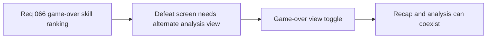

## item_248_define_a_game_over_view_toggle_between_recap_and_skill_ranking_analysis - Define a game over view toggle between recap and skill ranking analysis
> From version: 0.4.0
> Status: Draft
> Understanding: 99%
> Confidence: 98%
> Progress: 0%
> Complexity: Medium
> Theme: UI
> Reminder: Update status/understanding/confidence/progress and linked task references when you edit this doc.

# Problem
- The current game-over screen only exposes recap facts.
- Post-run skill analysis needs a bounded alternate view, not a full screen replacement.

# Scope
- In: a toggle or switch between recap and skill-ranking views.
- In: preserving the current recap.
- Out: victory-screen parity or broader run-history systems.

# Acceptance criteria
- AC1: The slice defines a bounded toggle or switch on the game-over screen.
- AC2: The slice preserves the current recap view.
- AC3: The slice should explicitly use `logics-ui-steering` for the outcome-surface presentation.

# Links
- Product brief(s): `prod_015_post_run_outcome_analysis_direction_for_skill_performance`
- Architecture decision(s): `adr_046_expose_post_run_skill_performance_summaries_as_shell_consumable_outcome_data`
- Request: `req_066_define_a_game_over_skill_ranking_view_toggle`

# Notes
- Derived from request `req_066_define_a_game_over_skill_ranking_view_toggle`.
