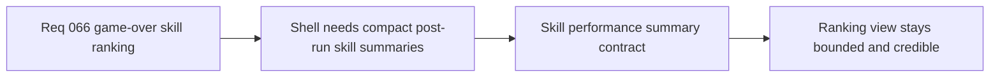

## item_249_define_a_first_pass_skill_performance_summary_contract_for_post_run_ranking - Define a first-pass skill performance summary contract for post-run ranking
> From version: 0.4.0
> Status: Draft
> Understanding: 99%
> Confidence: 98%
> Progress: 0%
> Complexity: Medium
> Theme: Architecture
> Reminder: Update status/understanding/confidence/progress and linked task references when you edit this doc.

# Problem
- A game-over ranking view needs compact skill summaries.
- The shell should not depend on raw combat-log playback to build that ranking.

# Scope
- In: a bounded post-run skill performance summary contract.
- In: a clear primary ranking metric for first pass.
- Out: exposing raw combat logs to the shell.

# Acceptance criteria
- AC1: The slice defines bounded post-run skill summaries for shell consumption.
- AC2: The slice defines one clear primary ranking metric for the first pass.
- AC3: The slice avoids requiring raw combat-log ownership in the shell.

# Links
- Product brief(s): `prod_015_post_run_outcome_analysis_direction_for_skill_performance`
- Architecture decision(s): `adr_046_expose_post_run_skill_performance_summaries_as_shell_consumable_outcome_data`
- Request: `req_066_define_a_game_over_skill_ranking_view_toggle`

# Notes
- Derived from request `req_066_define_a_game_over_skill_ranking_view_toggle`.
