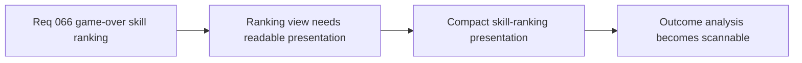

## item_250_define_a_compact_skill_ranking_presentation_for_game_over_analysis - Define a compact skill ranking presentation for game over analysis
> From version: 0.4.0
> Status: Done
> Understanding: 100%
> Confidence: 98%
> Progress: 100%
> Complexity: Medium
> Theme: UI
> Reminder: Update status/understanding/confidence/progress and linked task references when you edit this doc.

# Problem
- Even with skill summaries, the outcome screen still needs a compact, readable presentation.
- The view must feel like debrief analysis rather than a generic stats table.

# Scope
- In: ordered skill rows from strongest to weakest.
- In: compact post-run comparison posture.
- Out: full analytics dashboard visuals.

# Acceptance criteria
- AC1: The slice defines a compact ranked-skill presentation.
- AC2: The slice keeps the view readable and outcome-focused.
- AC3: The slice should explicitly use `logics-ui-steering` for outcome-scene presentation.

# Links
- Product brief(s): `prod_015_post_run_outcome_analysis_direction_for_skill_performance`
- Architecture decision(s): `adr_046_expose_post_run_skill_performance_summaries_as_shell_consumable_outcome_data`
- Request: `req_066_define_a_game_over_skill_ranking_view_toggle`

# Notes
- Derived from request `req_066_define_a_game_over_skill_ranking_view_toggle`.
