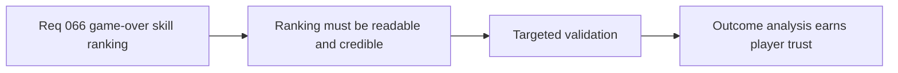

## item_251_define_targeted_validation_for_game_over_skill_analysis_readability_and_metric_credibility - Define targeted validation for game over skill analysis readability and metric credibility
> From version: 0.4.0
> Status: Draft
> Understanding: 99%
> Confidence: 98%
> Progress: 0%
> Complexity: Medium
> Theme: Quality
> Reminder: Update status/understanding/confidence/progress and linked task references when you edit this doc.

# Problem
- A post-run ranking view can mislead players if its metric or presentation is unclear.
- The project needs targeted validation for credibility and readability.

# Scope
- In: validation of ranking metric clarity and UI comprehension.
- In: bounded defeat-screen checks.
- Out: long-term analytics validation beyond this wave.

# Acceptance criteria
- AC1: The slice defines validation for ranking readability.
- AC2: The slice defines validation for metric credibility.
- AC3: The slice keeps validation bounded to the game-over analysis wave.

# Links
- Product brief(s): `prod_015_post_run_outcome_analysis_direction_for_skill_performance`
- Architecture decision(s): `adr_046_expose_post_run_skill_performance_summaries_as_shell_consumable_outcome_data`
- Request: `req_066_define_a_game_over_skill_ranking_view_toggle`

# Notes
- Derived from request `req_066_define_a_game_over_skill_ranking_view_toggle`.
