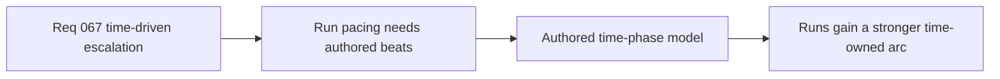

## item_252_define_an_authored_time_phase_model_for_run_progression_beats - Define an authored time-phase model for run progression beats
> From version: 0.4.0
> Status: Done
> Understanding: 100%
> Confidence: 98%
> Progress: 100%
> Complexity: Medium
> Theme: Gameplay
> Reminder: Update status/understanding/confidence/progress and linked task references when you edit this doc.

# Problem
- Runs need a stronger time-owned structure.
- The project needs explicit authored beats or phases, not just passive background scaling.

# Scope
- In: authored time thresholds or named phases.
- In: a readable first-pass phase model.
- Out: dynamic-director complexity.

# Acceptance criteria
- AC1: The slice defines an authored time-phase model.
- AC2: The slice keeps the phase model readable in the first pass.
- AC3: The slice avoids overcommitting to adaptive-director complexity.

# Links
- Product brief(s): `prod_016_time_owned_run_arc_and_authored_difficulty_phases`
- Architecture decision(s): `adr_047_structure_first_pass_run_difficulty_escalation_as_authored_time_phases`
- Request: `req_067_define_a_time_driven_run_progression_and_difficulty_escalation_wave`

# Notes
- Derived from request `req_067_define_a_time_driven_run_progression_and_difficulty_escalation_wave`.
