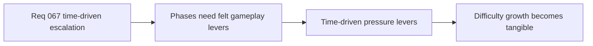

## item_253_define_first_pass_time_driven_pressure_levers_for_spawn_and_enemy_scaling - Define first-pass time-driven pressure levers for spawn and enemy scaling
> From version: 0.4.0
> Status: Draft
> Understanding: 99%
> Confidence: 98%
> Progress: 0%
> Complexity: Medium
> Theme: Gameplay
> Reminder: Update status/understanding/confidence/progress and linked task references when you edit this doc.

# Problem
- Time phases only matter if they drive felt gameplay pressure.
- The first pass needs bounded levers for escalation.

# Scope
- In: spawn pressure and enemy scaling as first-pass levers.
- In: bounded authored escalation.
- Out: exotic encounter-composition systems in the same slice.

# Acceptance criteria
- AC1: The slice defines bounded first-pass pressure levers.
- AC2: The slice starts with spawn and enemy scaling.
- AC3: The slice remains authored and readable.

# Links
- Product brief(s): `prod_016_time_owned_run_arc_and_authored_difficulty_phases`
- Architecture decision(s): `adr_047_structure_first_pass_run_difficulty_escalation_as_authored_time_phases`
- Request: `req_067_define_a_time_driven_run_progression_and_difficulty_escalation_wave`

# Notes
- Derived from request `req_067_define_a_time_driven_run_progression_and_difficulty_escalation_wave`.
