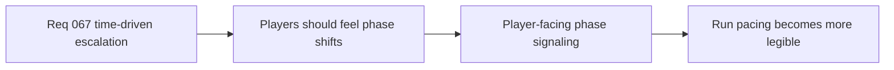

## item_254_define_player_facing_phase_signaling_for_time_driven_run_escalation - Define player-facing phase signaling for time-driven run escalation
> From version: 0.4.0
> Status: Done
> Understanding: 100%
> Confidence: 98%
> Progress: 100%
> Complexity: Medium
> Theme: UX
> Reminder: Update status/understanding/confidence/progress and linked task references when you edit this doc.

# Problem
- Time-driven escalation is less valuable if players cannot feel when a phase changes.
- The game needs bounded player-facing phase signaling.

# Scope
- In: light phase-change signaling or messaging.
- In: readable pacing cues.
- Out: full cinematic wave announcements.

# Acceptance criteria
- AC1: The slice defines light player-facing phase signaling.
- AC2: The slice keeps the signaling readable and bounded.
- AC3: The slice supports the authored time-phase posture.

# Links
- Product brief(s): `prod_016_time_owned_run_arc_and_authored_difficulty_phases`
- Architecture decision(s): `adr_047_structure_first_pass_run_difficulty_escalation_as_authored_time_phases`
- Request: `req_067_define_a_time_driven_run_progression_and_difficulty_escalation_wave`

# Notes
- Derived from request `req_067_define_a_time_driven_run_progression_and_difficulty_escalation_wave`.
