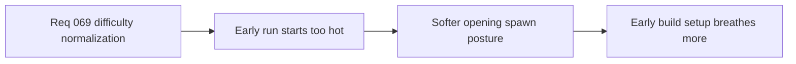

## item_256_define_a_softer_opening_hostile_spawn_posture_for_the_time_owned_run_arc - Define a softer opening hostile spawn posture for the time-owned run arc
> From version: 0.4.0
> Status: Done
> Understanding: 95%
> Confidence: 95%
> Progress: 100%
> Complexity: Medium
> Theme: Gameplay
> Reminder: Update status/understanding/confidence/progress and linked task references when you edit this doc.

# Problem
- The opening run pressure still starts too hot relative to early build establishment.

# Scope
- In: fewer early hostile spawns and gentler opening spawn cadence.
- In: authored first-minute readability.
- Out: late-run composition tiers and mini-boss beats in the same slice.

# Acceptance criteria
- AC1: The slice defines a gentler opening spawn posture.
- AC2: The slice reduces both early hostile count and early spawn cadence pressure.
- AC3: The slice stays compatible with the authored time-phase model.

# Links
- Architecture decision(s): `adr_049_structure_time_scaled_enemy_pressure_around_authored_population_opening_composition_tiers_and_mini_boss_beats`
- Request: `req_069_define_a_smoother_early_game_and_stronger_time_scaled_enemy_pressure_wave`

# Notes
- Derived from request `req_069_define_a_smoother_early_game_and_stronger_time_scaled_enemy_pressure_wave`.
