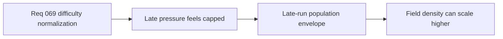

## item_257_define_a_more_open_late_run_hostile_population_envelope - Define a more open late-run hostile population envelope
> From version: 0.4.0
> Status: Draft
> Understanding: 95%
> Confidence: 95%
> Progress: 0%
> Complexity: Medium
> Theme: Gameplay
> Reminder: Update status/understanding/confidence/progress and linked task references when you edit this doc.

# Problem
- Late-run field pressure still feels too capped even when the run should become crowded and oppressive.

# Scope
- In: stronger scaling of simultaneous hostile capacity and replenishment posture over time.
- In: authored density growth by phase.
- Out: stronger enemy archetype composition and mini-boss rules in the same slice.

# Acceptance criteria
- AC1: The slice defines a more open late-run hostile population envelope.
- AC2: The slice allows denser late-run pressure than the current cap posture.
- AC3: The slice remains phase-authored and legible.

# Links
- Architecture decision(s): `adr_049_structure_time_scaled_enemy_pressure_around_authored_population_opening_composition_tiers_and_mini_boss_beats`
- Request: `req_069_define_a_smoother_early_game_and_stronger_time_scaled_enemy_pressure_wave`

# Notes
- Derived from request `req_069_define_a_smoother_early_game_and_stronger_time_scaled_enemy_pressure_wave`.
