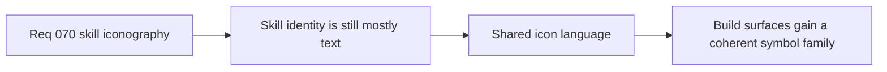

## item_261_define_a_shared_techno_shinobi_icon_language_for_build_facing_skill_assets - Define a shared techno-shinobi icon language for build-facing skill assets
> From version: 0.4.0
> Status: Draft
> Understanding: 95%
> Confidence: 95%
> Progress: 0%
> Complexity: Medium
> Theme: UI
> Reminder: Update status/understanding/confidence/progress and linked task references when you edit this doc.

# Problem
- Skill identity is still mostly text-driven and lacks a coherent icon family.

# Scope
- In: one shared icon language for active, passive, and fusion representation.
- In: techno-shinobi guardrails and vector-first readability.
- Out: broad HUD or menu redesign beyond iconography.

# Acceptance criteria
- AC1: The slice defines one shared icon family for build-facing skills.
- AC2: The slice keeps the language techno-shinobi and small-size readable.
- AC3: The slice explicitly uses `logics-ui-steering`.

# Links
- Architecture decision(s): `adr_050_use_a_shared_vector_first_techno_shinobi_icon_family_for_build_facing_skill_representation`
- Request: `req_070_define_a_techno_shinobi_iconography_wave_for_active_passive_and_fusion_skills`

# Notes
- Derived from request `req_070_define_a_techno_shinobi_iconography_wave_for_active_passive_and_fusion_skills`.
