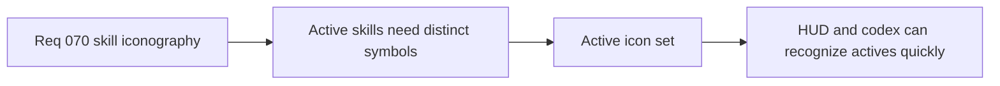

## item_262_define_the_first_active_skill_icon_set_for_the_playable_roster - Define the first active skill icon set for the playable roster
> From version: 0.4.0
> Status: Draft
> Understanding: 95%
> Confidence: 95%
> Progress: 0%
> Complexity: Medium
> Theme: UI
> Reminder: Update status/understanding/confidence/progress and linked task references when you edit this doc.

# Problem
- Active skills still lack distinct icon identity in the playable roster.

# Scope
- In: first-pass icon set for the playable active skills.
- In: role-distinct symbols with readable silhouettes.
- Out: passive and fusion icon derivation in the same slice.

# Acceptance criteria
- AC1: The slice defines a first-pass active skill icon set.
- AC2: Each active icon remains distinguishable by role.
- AC3: The icons stay readable at HUD and codex sizes.

# Links
- Architecture decision(s): `adr_050_use_a_shared_vector_first_techno_shinobi_icon_family_for_build_facing_skill_representation`
- Request: `req_070_define_a_techno_shinobi_iconography_wave_for_active_passive_and_fusion_skills`

# Notes
- Derived from request `req_070_define_a_techno_shinobi_iconography_wave_for_active_passive_and_fusion_skills`.
