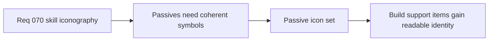

## item_263_define_the_first_passive_item_icon_set_for_the_playable_roster - Define the first passive item icon set for the playable roster
> From version: 0.4.0
> Status: Done
> Understanding: 95%
> Confidence: 95%
> Progress: 100%
> Complexity: Medium
> Theme: UI
> Reminder: Update status/understanding/confidence/progress and linked task references when you edit this doc.

# Problem
- Passive items need icon identity but should not visually overpower active combat tools.

# Scope
- In: first-pass passive icon set.
- In: quieter but related icon posture within the shared family.
- Out: fusion derivative rules in the same slice.

# Acceptance criteria
- AC1: The slice defines a first-pass passive icon set.
- AC2: Passive icons feel related to actives but slightly quieter.
- AC3: The icons stay readable at HUD and archive sizes.

# Links
- Architecture decision(s): `adr_050_use_a_shared_vector_first_techno_shinobi_icon_family_for_build_facing_skill_representation`
- Request: `req_070_define_a_techno_shinobi_iconography_wave_for_active_passive_and_fusion_skills`

# Notes
- Derived from request `req_070_define_a_techno_shinobi_iconography_wave_for_active_passive_and_fusion_skills`.
