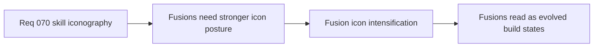

## item_264_define_fusion_icon_intensification_as_a_derivative_of_base_build_identity - Define fusion icon intensification as a derivative of base build identity
> From version: 0.4.0
> Status: Draft
> Understanding: 95%
> Confidence: 95%
> Progress: 0%
> Complexity: Medium
> Theme: UI
> Reminder: Update status/understanding/confidence/progress and linked task references when you edit this doc.

# Problem
- Fusions need stronger visual identity without becoming a disconnected icon language.

# Scope
- In: fusion icon intensification or evolution rules.
- In: derivative relationship to base active/passive identity.
- Out: unrelated prestige or rarity badge systems.

# Acceptance criteria
- AC1: The slice defines fusion icons as intensified derivatives of base build identity.
- AC2: Fusion icons remain readable and recognizably related to the roster.
- AC3: The slice avoids disconnected icon families.

# Links
- Architecture decision(s): `adr_050_use_a_shared_vector_first_techno_shinobi_icon_family_for_build_facing_skill_representation`
- Request: `req_070_define_a_techno_shinobi_iconography_wave_for_active_passive_and_fusion_skills`

# Notes
- Derived from request `req_070_define_a_techno_shinobi_iconography_wave_for_active_passive_and_fusion_skills`.
