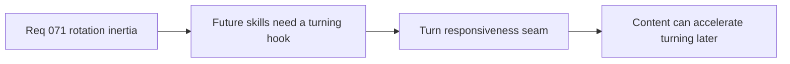

## item_268_define_a_future_modifier_seam_for_authored_turn_responsiveness_changes - Define a future modifier seam for authored turn responsiveness changes
> From version: 0.4.0
> Status: Done
> Understanding: 95%
> Confidence: 96%
> Progress: 100%
> Complexity: Medium
> Theme: Gameplay
> Reminder: Update status/understanding/confidence/progress and linked task references when you edit this doc.

# Problem
- Future skills or passives need a clear way to accelerate turning without reopening movement architecture.

# Scope
- In: authored turn responsiveness seam for future modifiers.
- In: compatibility with skills/passives/upgrades later.
- Out: implementing those content modifiers in the same slice.

# Acceptance criteria
- AC1: The slice defines a future modifier seam for turn responsiveness.
- AC2: The slice avoids reopening movement architecture later for turn-speed content.
- AC3: The slice stays bounded and does not implement full content modifiers yet.

# Links
- Architecture decision(s): `adr_051_resolve_player_orientation_through_a_bounded_simulation_owned_turn_rate`
- Request: `req_071_define_a_bounded_entity_rotation_inertia_and_turn_rate_wave`

# Notes
- Derived from request `req_071_define_a_bounded_entity_rotation_inertia_and_turn_rate_wave`.
