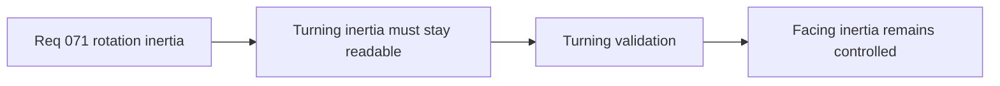

## item_269_define_targeted_validation_for_player_turning_readability_and_responsiveness - Define targeted validation for player turning readability and responsiveness
> From version: 0.4.0
> Status: Draft
> Understanding: 95%
> Confidence: 96%
> Progress: 0%
> Complexity: Medium
> Theme: Gameplay
> Reminder: Update status/understanding/confidence/progress and linked task references when you edit this doc.

# Problem
- Rotation inertia is only useful if it removes snap without making steering muddy.

# Scope
- In: validation for hard reversals, ordinary steering arcs, and responsiveness feel.
- Out: broad balance tuning across the entire build loop.

# Acceptance criteria
- AC1: The slice defines targeted validation for player turning readability and responsiveness.
- AC2: The slice covers hard reversals and ordinary steering arcs.
- AC3: The slice verifies that control clarity remains acceptable.

# Links
- Architecture decision(s): `adr_051_resolve_player_orientation_through_a_bounded_simulation_owned_turn_rate`
- Request: `req_071_define_a_bounded_entity_rotation_inertia_and_turn_rate_wave`

# Notes
- Derived from request `req_071_define_a_bounded_entity_rotation_inertia_and_turn_rate_wave`.
