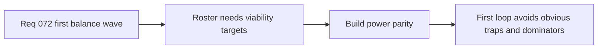

## item_270_define_first_pass_parity_targets_for_active_passive_and_fusion_build_power - Define first-pass parity targets for active, passive, and fusion build power
> From version: 0.4.0
> Status: Draft
> Understanding: 95%
> Confidence: 95%
> Progress: 0%
> Complexity: Medium
> Theme: Gameplay
> Reminder: Update status/understanding/confidence/progress and linked task references when you edit this doc.

# Problem
- The first playable roster needs viability targets or the loop will drift into obvious dominant and dead options.

# Scope
- In: first-pass parity review across actives, passives, and fusions.
- In: baseline viability rather than perfect symmetry.
- Out: final content expansion or late-game exotic interactions.

# Acceptance criteria
- AC1: The slice defines first-pass parity targets across actives, passives, and fusions.
- AC2: The slice aims for viable parity rather than identical strength.
- AC3: The slice remains suitable for a first authored balance baseline.

# Links
- Architecture decision(s): `adr_036_externalize_retunable_gameplay_and_system_tuning_as_validated_json_contracts`
- Request: `req_072_define_a_first_playable_balance_wave_for_build_power_run_economy_and_difficulty_pacing`

# Notes
- Derived from request `req_072_define_a_first_playable_balance_wave_for_build_power_run_economy_and_difficulty_pacing`.
