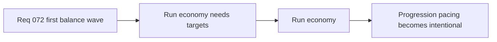

## item_271_define_first_pass_run_economy_targets_for_xp_level_ups_chests_and_gold - Define first-pass run economy targets for XP, level-ups, chests, and gold
> From version: 0.4.0
> Status: Draft
> Understanding: 95%
> Confidence: 95%
> Progress: 0%
> Complexity: Medium
> Theme: Gameplay
> Reminder: Update status/understanding/confidence/progress and linked task references when you edit this doc.

# Problem
- Run economy needs explicit targets or progression will feel erratic or arbitrary.

# Scope
- In: XP gain, level-up cadence, chest timing/value, and gold pacing.
- In: first-pass economy targets that support the first playable loop.
- Out: long-term meta-progression economy.

# Acceptance criteria
- AC1: The slice defines first-pass run economy targets.
- AC2: The slice covers XP, level-ups, chests, and gold where relevant.
- AC3: The slice stays focused on the first playable run loop.

# Links
- Architecture decision(s): `adr_036_externalize_retunable_gameplay_and_system_tuning_as_validated_json_contracts`
- Request: `req_072_define_a_first_playable_balance_wave_for_build_power_run_economy_and_difficulty_pacing`

# Notes
- Derived from request `req_072_define_a_first_playable_balance_wave_for_build_power_run_economy_and_difficulty_pacing`.
