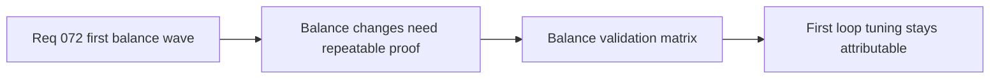

## item_273_define_a_repeatable_balance_validation_matrix_for_the_first_playable_loop - Define a repeatable balance validation matrix for the first playable loop
> From version: 0.4.0
> Status: Draft
> Understanding: 95%
> Confidence: 95%
> Progress: 0%
> Complexity: Medium
> Theme: Gameplay
> Reminder: Update status/understanding/confidence/progress and linked task references when you edit this doc.

# Problem
- First-pass balance needs repeatable checks or future tuning changes will be hard to compare.

# Scope
- In: repeatable validation matrix for build power, economy, and pacing.
- In: scripted and manual validation posture.
- Out: live telemetry frameworks.

# Acceptance criteria
- AC1: The slice defines a repeatable balance validation matrix.
- AC2: The slice combines scripted and manual play-feel validation.
- AC3: The slice stays bounded to the first playable loop.

# Links
- Architecture decision(s): `adr_036_externalize_retunable_gameplay_and_system_tuning_as_validated_json_contracts`
- Request: `req_072_define_a_first_playable_balance_wave_for_build_power_run_economy_and_difficulty_pacing`

# Notes
- Derived from request `req_072_define_a_first_playable_balance_wave_for_build_power_run_economy_and_difficulty_pacing`.
