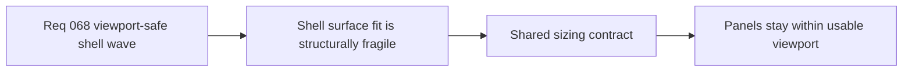

## item_274_define_a_shared_viewport_safe_shell_surface_sizing_contract - Define a shared viewport-safe shell surface sizing contract
> From version: 0.4.0
> Status: Done
> Understanding: 100%
> Confidence: 98%
> Progress: 100%
> Complexity: Medium
> Theme: UI
> Reminder: Update status/understanding/confidence/progress and linked task references when you edit this doc.

# Problem
- Shell-owned panels still risk exceeding the usable viewport because sizing rules are spread across the app root, shell container, and scene-specific overrides.
- This makes viewport fit fragile whenever a new scene or a denser content layout is introduced.
- The shell needs one shared sizing contract that bounds panel height safely before scroll behavior is even considered.

# Scope
- In: defining the shared panel sizing posture for shell-owned scenes that can vary in content height.
- In: ensuring viewport-safe `max-height` or equivalent bounded sizing is applied consistently.
- In: aligning surface sizing with desktop, mobile browser, and non-PWA safe-area realities.
- Out: scene-specific scroll-body implementation details.
- Out: unrelated shell visual redesign.

# Acceptance criteria
- AC1: The slice defines one shared shell-surface sizing posture for variable-height panels.
- AC2: The slice requires bounded viewport-safe sizing instead of rigid fixed heights for content-heavy shell scenes.
- AC3: The slice accounts for desktop, mobile browser, and non-PWA viewport constraints.
- AC4: The slice stays focused on surface fit and does not expand into full per-scene overflow behavior.

# AC Traceability
- AC1 -> Scope: one shared sizing posture is explicit. Proof target: shared shell panel CSS/layout contract.
- AC2 -> Scope: bounded sizing is required. Proof target: removal or override of fragile fixed-height patterns.
- AC3 -> Scope: multi-viewport fit is explicit. Proof target: responsive verification notes and CSS contract.
- AC4 -> Scope: scroll ownership remains separate. Proof target: file scope and exclusions.

# Request AC Traceability
- AC1 -> Slice coverage: `item_274` owns the shared surface-fit slice of the cross-cutting shell correction wave. Proof: `src/app/styles/app.css` centralizes the shell panel family around one `.app-meta-scene` sizing contract.
- AC2 -> Failure-mode framing: this slice treats clipping as a viewport-fit contract problem instead of a one-off styling issue. Proof: `src/app/styles/app.css` uses safe-area offsets, viewport units, and shared scene bounds rather than scene-specific cosmetic tweaks alone.
- AC4 -> Viewport-fit posture: shell panels are bounded for desktop, mobile browser, and non-PWA contexts. Proof: `src/app/styles/app.css` uses `100dvh`, browser-mode `100svh`, and shared shell offsets for `.app-shell` and `.app-meta-scene`.
- AC5 -> Bounded sizing rule: variable-height shell surfaces prefer bounded `max-height` and per-scene bounded heights over unconstrained growth. Proof: `src/app/styles/app.css` defines shared `max-height` on `.app-meta-scene` and bounded heights for `changelogs`, `settings`, `grimoire`, `bestiary`, and `defeat`.

# Decision framing
- Product framing: Required
- Product signals: reachability, presentation quality
- Product follow-up: use `logics-ui-steering` so viewport-safe sizing remains aligned with the techno-shinobi shell language rather than becoming a generic modal patch.
- Architecture framing: Required
- Architecture signals: shared shell contract
- Architecture follow-up: align implementation with `adr_048_adopt_a_viewport_safe_scroll_owner_contract_for_shell_surfaces`.

# Links
- Product brief(s): `prod_005_visual_identity_dark_fantasy_with_synthetic_energy_accents`
- Architecture decision(s): `adr_048_adopt_a_viewport_safe_scroll_owner_contract_for_shell_surfaces`
- Request: `req_068_define_a_viewport_safe_scroll_ownership_wave_for_shell_surfaces`
- Primary task(s): `task_056_orchestrate_viewport_safe_scroll_ownership_for_shell_surfaces`

# References
- `logics/request/req_068_define_a_viewport_safe_scroll_ownership_wave_for_shell_surfaces.md`
- `logics/architecture/adr_048_adopt_a_viewport_safe_scroll_owner_contract_for_shell_surfaces.md`

# Priority
- Impact: High
- Urgency: High

# Notes
- Derived from request `req_068_define_a_viewport_safe_scroll_ownership_wave_for_shell_surfaces`.
- Shell/UI work in this slice should explicitly lean on `logics-ui-steering`.
- Closed through `task_056_orchestrate_viewport_safe_scroll_ownership_for_shell_surfaces` once the shared shell surface bounds landed in commit `ea04d9d`.
