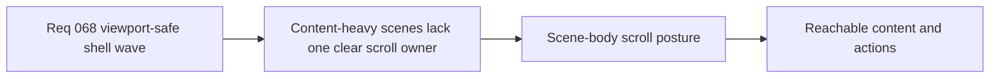

## item_275_define_a_single_scroll_owner_scene_body_posture_for_variable_height_shell_content - Define a single scroll-owner scene-body posture for variable-height shell content
> From version: 0.4.0
> Status: Done
> Understanding: 100%
> Confidence: 98%
> Progress: 100%
> Complexity: Medium
> Theme: UI
> Reminder: Update status/understanding/confidence/progress and linked task references when you edit this doc.

# Problem
- Even when a shell panel fits the viewport, content-heavy scenes still fail when no clear inner region owns vertical overflow.
- Current scenes mix nested lists and hidden overflow, which makes scrolling inconsistent and can trap important actions out of reach.
- The shell needs a default scene-body scroll-owner posture that future scenes can copy safely.

# Scope
- In: defining one primary vertical scroll owner for variable-content shell scenes.
- In: keeping header, footer, and primary actions reachable while the body absorbs overflow.
- In: defining when nested scrollers are acceptable and subordinate.
- Out: per-screen content tuning or copy cleanup.
- Out: document-level page scroll for shell scenes.

# Acceptance criteria
- AC1: The slice defines one primary vertical scroll owner for variable-height shell scenes.
- AC2: The slice requires body overflow to be owned by the scene body instead of scattered nested regions by default.
- AC3: The slice requires header/footer chrome and primary actions to remain reachable while the body scrolls.
- AC4: The slice defines a bounded rule for nested scrollers rather than banning or allowing them implicitly.

# AC Traceability
- AC1 -> Scope: one primary scroll owner is explicit. Proof target: shared scene-body structure and CSS.
- AC2 -> Scope: body-owned overflow is explicit. Proof target: reduced reliance on ad hoc nested scrolling.
- AC3 -> Scope: action reachability is explicit. Proof target: manual verification and layout structure.
- AC4 -> Scope: nested scrollers are bounded. Proof target: implementation notes and review guidance.

# Request AC Traceability
- AC1 -> Slice coverage: `item_275` owns the scroll-owner part of the cross-cutting shell correction wave. Proof: `task_056` closes this slice alongside shared shell sizing and regression cleanup.
- AC2 -> Failure-mode framing: the fix moves overflow responsibility into one named scene body instead of scattered nested containers. Proof: `src/app/styles/app.css` defines `.app-meta-scene__scene-body--settings` and `.app-meta-scene__scene-body--scroll` as the primary overflow owners.
- AC3 -> Scroll-owner rule: content-heavy shell scenes now declare an explicit internal scroll owner. Proof: `src/app/components/AppMetaScenePanel.tsx` wraps `Grimoire`, `Bestiary`, `Settings`, and `Game over` content in `.app-meta-scene__scene-body` containers.
- AC6 -> Reachable actions: the header/footer chrome and bottom actions remain outside the scroll owner. Proof: `src/app/styles/app.css` uses `grid-template-rows: auto minmax(0, 1fr) auto`, and `src/app/components/AppMetaScenePanel.tsx` renders action rows separately from the scene body.
- AC8 -> Prevention posture: the shell now has a reusable named body-scroll pattern for future scenes instead of ad hoc overflow rules. Proof: `.app-meta-scene__scene-body--scroll` and `.app-meta-scene__scene-body--settings` provide the shared default posture reused by archive, settings, and outcome scenes.

# Decision framing
- Product framing: Required
- Product signals: usability, content readability
- Product follow-up: use `logics-ui-steering` so the scene-body posture still feels like the techno-shinobi shell rather than a generic scroll panel.
- Architecture framing: Required
- Architecture signals: shell scene ownership
- Architecture follow-up: align implementation with `adr_048_adopt_a_viewport_safe_scroll_owner_contract_for_shell_surfaces`.

# Links
- Product brief(s): `prod_005_visual_identity_dark_fantasy_with_synthetic_energy_accents`
- Architecture decision(s): `adr_048_adopt_a_viewport_safe_scroll_owner_contract_for_shell_surfaces`
- Request: `req_068_define_a_viewport_safe_scroll_ownership_wave_for_shell_surfaces`
- Primary task(s): `task_056_orchestrate_viewport_safe_scroll_ownership_for_shell_surfaces`

# References
- `logics/request/req_068_define_a_viewport_safe_scroll_ownership_wave_for_shell_surfaces.md`
- `logics/architecture/adr_048_adopt_a_viewport_safe_scroll_owner_contract_for_shell_surfaces.md`

# Priority
- Impact: High
- Urgency: High

# Notes
- Derived from request `req_068_define_a_viewport_safe_scroll_ownership_wave_for_shell_surfaces`.
- Shell/UI work in this slice should explicitly lean on `logics-ui-steering`.
- Closed through `task_056_orchestrate_viewport_safe_scroll_ownership_for_shell_surfaces` when the shared scene-body scroll owner contract landed across shell scenes.
