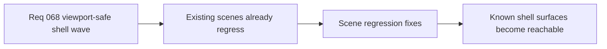

## item_276_define_regression_fixes_for_existing_shell_scenes_under_the_viewport_safe_scroll_contract - Define regression fixes for existing shell scenes under the viewport-safe scroll contract
> From version: 0.4.0
> Status: Done
> Understanding: 100%
> Confidence: 98%
> Progress: 100%
> Complexity: Medium
> Theme: UI
> Reminder: Update status/understanding/confidence/progress and linked task references when you edit this doc.

# Problem
- Several existing shell scenes have already shown clipping or unreachable-bottom regressions.
- Without an explicit regression slice, the new contract risks being partially applied while old scenes keep diverging.
- The highest-risk scenes need to be brought under the new contract together.

# Scope
- In: applying the viewport-safe sizing and scroll-owner contract to known high-risk scenes.
- In: regression review for `Settings`, `Changelogs`, `Grimoire`, `Bestiary`, `Game over`, `Pause`, and shell-adjacent auxiliary panels where relevant.
- In: ensuring bottom actions like `Back`, `Apply`, `Resume`, and outcome actions remain reachable.
- Out: unrelated scene copy or layout redesign beyond what is needed for viewport-safe behavior.

# Acceptance criteria
- AC1: The slice explicitly targets the known regression-prone shell scenes named in the request.
- AC2: The slice requires bottom actions and critical content to remain reachable on each targeted scene.
- AC3: The slice stays bounded to viewport-safe and scroll-ownership corrections instead of broad visual redesign.
- AC4: The slice includes shell-adjacent auxiliary panels when they share the same failure mode.

# AC Traceability
- AC1 -> Scope: named scenes are explicit. Proof target: scene list and implementation coverage.
- AC2 -> Scope: action reachability is explicit. Proof target: manual verification and layout checks.
- AC3 -> Scope: wave remains bounded. Proof target: file scope and exclusions.
- AC4 -> Scope: auxiliary panels are considered. Proof target: explicit inclusion or rationale for exclusion.

# Request AC Traceability
- AC1 -> Slice coverage: `item_276` applies the request wave to the known regression-prone shell surfaces instead of leaving them as isolated follow-ups. Proof: `src/app/components/AppMetaScenePanel.tsx` now routes `Changelogs`, `Grimoire`, `Bestiary`, `Pause`, `Settings`, and `Game over` through bounded shell-scene layouts.
- AC2 -> Failure-mode framing: the regression fixes target clipping, missing scroll ownership, and unreachable actions rather than a broad shell restyle. Proof: the implementation changes panel structure, body ownership, and action placement in `src/app/styles/app.css` and `src/app/components/AppMetaScenePanel.tsx`.
- AC4 -> Viewport-fit posture: the targeted scenes stay inside the safe shell bounds across supported viewport contexts. Proof: `src/app/styles/app.css` assigns bounded heights to the affected scenes and shares the same shell offset contract.
- AC6 -> Reachable actions: `Back to menu`, `Resume runtime`, and outcome actions remain outside the scrolling body. Proof: `src/app/components/AppMetaScenePanel.tsx` renders each affected scene with a dedicated `.app-meta-scene__actions` block after the scrollable content.
- AC7 -> Named regression review: the request’s scene list is explicitly covered by this slice. Proof: the `changelogs`, `settings`, `grimoire`, `bestiary`, `pause`, and `defeat` branches all exist in `src/app/components/AppMetaScenePanel.tsx`, with `defeat` carrying the `Game over` surface.

# Decision framing
- Product framing: Required
- Product signals: usability, trust, polish
- Product follow-up: use `logics-ui-steering` when touching scene layouts so fixes stay coherent with the shell’s techno-shinobi visual system.
- Architecture framing: Consider
- Architecture signals: shell consistency
- Architecture follow-up: use this slice to validate `adr_048` against real scene diversity.

# Links
- Product brief(s): `prod_005_visual_identity_dark_fantasy_with_synthetic_energy_accents`
- Architecture decision(s): `adr_048_adopt_a_viewport_safe_scroll_owner_contract_for_shell_surfaces`
- Request: `req_068_define_a_viewport_safe_scroll_ownership_wave_for_shell_surfaces`
- Primary task(s): `task_056_orchestrate_viewport_safe_scroll_ownership_for_shell_surfaces`

# References
- `logics/request/req_068_define_a_viewport_safe_scroll_ownership_wave_for_shell_surfaces.md`
- `logics/architecture/adr_048_adopt_a_viewport_safe_scroll_owner_contract_for_shell_surfaces.md`

# Priority
- Impact: High
- Urgency: High

# Notes
- Derived from request `req_068_define_a_viewport_safe_scroll_ownership_wave_for_shell_surfaces`.
- Shell/UI work in this slice should explicitly lean on `logics-ui-steering`.
- Closed through `task_056_orchestrate_viewport_safe_scroll_ownership_for_shell_surfaces`, with the archive follow-up refined again in commit `8230748`.
