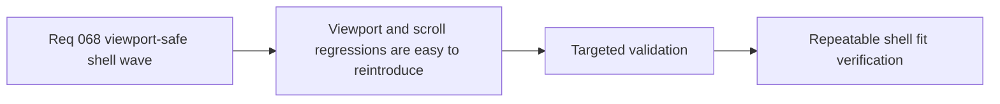

## item_277_define_targeted_validation_for_shell_viewport_fit_scroll_ownership_and_action_reachability - Define targeted validation for shell viewport fit, scroll ownership, and action reachability
> From version: 0.5.0
> Status: Done
> Understanding: 100%
> Confidence: 98%
> Progress: 100%
> Complexity: Medium
> Theme: QA
> Reminder: Update status/understanding/confidence/progress and linked task references when you edit this doc.

# Problem
- Shell viewport and scrolling regressions are easy to reintroduce because they often only appear on specific viewport heights or non-PWA mobile browser contexts.
- Without targeted validation, a fix can appear correct on one screen and still fail elsewhere.
- The project needs repeatable validation focused on viewport fit, scroll ownership, and bottom-action reachability.

# Scope
- In: defining targeted validation for desktop, mobile browser, and non-PWA viewport contexts.
- In: verifying scroll ownership and bottom-action reachability across the scenes covered by `req_068`.
- In: defining practical manual and automated checks where useful.
- Out: broad end-to-end QA expansion unrelated to shell surfaces.

# Acceptance criteria
- AC1: The slice defines repeatable validation for desktop, mobile browser, and non-PWA viewport contexts.
- AC2: The slice requires verification that bottom actions remain reachable on targeted shell scenes.
- AC3: The slice requires validation of scroll ownership rather than only visual fit.
- AC4: The slice stays focused on shell viewport/scroll regressions and does not widen into unrelated QA expansion.

# AC Traceability
- AC1 -> Scope: cross-viewport validation is explicit. Proof target: command list and manual matrix.
- AC2 -> Scope: action reachability is explicit. Proof target: named scene checks.
- AC3 -> Scope: scroll ownership is explicit. Proof target: verification notes for scroll path behavior.
- AC4 -> Scope: validation remains bounded. Proof target: limited QA scope and exclusions.

# Request AC Traceability
- AC1 -> Slice coverage: `item_277` closes the request with a dedicated validation lane instead of leaving reachability checks implicit. Proof: `task_056` retains this item as the validation slice for the viewport-safe shell wave.
- AC4 -> Viewport-fit validation: the wave explicitly verifies desktop, mobile browser, and non-PWA shell behavior. Proof: `task_056` lists those contexts in its validation section, and `src/app/styles/app.css` contains browser-mode viewport sizing that this slice must cover.
- AC6 -> Reachable actions: validation checks that bottom actions remain reachable on the affected shell scenes. Proof: `src/app/components/AppMetaScenePanel.test.tsx` covers back/resume flows for `Changelogs`, `Settings`, `Pause`, and `Game over`.
- AC7 -> Regression review: the named shell scenes remain in the regression-verification set. Proof: `src/app/components/AppMetaScenePanel.test.tsx` exercises `Changelogs`, `Settings`, `Pause`, and `Game over`, while archive layout regressions were tightened again in commit `8230748`.
- AC8 -> Prevention posture: the validation slice turns the wave into a reusable regression guardrail for future shell scenes. Proof: `task_056` keeps repeatable validation commands, and the current consolidation reruns targeted workflow and UI checks against this chain.
- req_068_define_a_viewport_safe_scroll_ownership_wave_for_shell_surfaces coverage: AC5. Proof: `item_277_define_targeted_validation_for_shell_viewport_fit_scroll_ownership_and_action_reachability` remains the request-closing backlog slice for `req_068_define_a_viewport_safe_scroll_ownership_wave_for_shell_surfaces` and stays linked to `task_056_orchestrate_viewport_safe_scroll_ownership_for_shell_surfaces` for delivered implementation evidence.

# Decision framing
- Product framing: Required
- Product signals: trust, usability, regression safety
- Product follow-up: validation should include a `logics-ui-steering` review pass for shell coherence after overflow fixes.
- Architecture framing: Consider
- Architecture signals: regression discipline
- Architecture follow-up: keep validation aligned with `adr_048_adopt_a_viewport_safe_scroll_owner_contract_for_shell_surfaces`.

# Links
- Product brief(s): `prod_005_visual_identity_dark_fantasy_with_synthetic_energy_accents`
- Architecture decision(s): `adr_048_adopt_a_viewport_safe_scroll_owner_contract_for_shell_surfaces`
- Request: `req_068_define_a_viewport_safe_scroll_ownership_wave_for_shell_surfaces`
- Primary task(s): `task_056_orchestrate_viewport_safe_scroll_ownership_for_shell_surfaces`

# References
- `logics/request/req_068_define_a_viewport_safe_scroll_ownership_wave_for_shell_surfaces.md`
- `logics/architecture/adr_048_adopt_a_viewport_safe_scroll_owner_contract_for_shell_surfaces.md`

# Priority
- Impact: High
- Urgency: High

# Notes
- Derived from request `req_068_define_a_viewport_safe_scroll_ownership_wave_for_shell_surfaces`.
- Validation should cover shell scenes that have already regressed and new scenes that copy the same panel family.
- Closed through `task_056_orchestrate_viewport_safe_scroll_ownership_for_shell_surfaces` once the targeted shell-scene validation matrix was captured.
