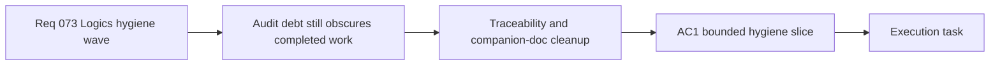

## item_278_consolidate_remaining_logics_traceability_and_companion_doc_hygiene_wave - Consolidate remaining Logics traceability and companion-doc hygiene wave
> From version: 0.5.0
> Schema version: 1.0
> Status: Done
> Understanding: 100%
> Confidence: 98%
> Progress: 100%
> Complexity: High
> Theme: Delivery
> Reminder: Update status/understanding/confidence/progress and linked task references when you edit this doc.

# Problem
- The repository still carries concentrated Logics audit debt even after the legacy request-closure cleanup and backlog-ref consolidation passes.
- The remaining issues were workflow-owned, not product-owned: `485` missing task traceability proofs, `471` missing item traceability proofs, `42` missing companion mermaids, `14` missing product refs, `3` missing ADR refs, `3` unchecked task DoD blocks, and `2` companion docs without a primary link.
- Without one explicit hygiene slice, the corpus will continue to misreport completed work as incomplete and future waves will inherit noisy workflow signals.
- This slice is now closed after companion-doc structure, required refs, DoD hygiene, and request-level AC traceability were backfilled across the affected request chains.

# Scope
- In: backfilling request-to-backlog and request-to-task AC traceability with explicit `Proof:` lines where the workflow audit requires them.
- In: restoring missing overview mermaids and missing primary/companion references for product and architecture docs that the audit currently flags.
- In: repairing the remaining required product/ADR refs and unchecked task DoD drift where the workflow rules mandate them.
- In: using the workflow audit and Logics lint as the primary success criteria for the slice.
- Out: gameplay, runtime, UI, release, or build-system behavior changes unrelated to the `logics/` corpus itself.

# Acceptance criteria
- AC1: The slice defines one bounded Logics-hygiene delivery scope rather than a broad repository rewrite.
- AC2: The slice explicitly targets the remaining request-to-item and request-to-task AC traceability debt with proof-bearing updates.
- AC3: The slice explicitly targets the remaining companion-doc structure debt, including missing overview mermaids and missing primary-link coverage.
- AC4: The slice explicitly repairs the remaining required product/ADR refs and unchecked task DoD blocks that are still audit-visible.
- AC5: The slice defines success through a materially improved workflow audit plus passing `logics:lint`, not through unrelated product behavior changes.

# AC Traceability
- AC1 -> Scope: the work stays bounded to Logics hygiene. Proof: only `logics/*` docs and workflow validation commands are in scope.
- AC2 -> Scope: traceability debt is explicit. Proof: workflow audit baseline currently reports `485` `ac_missing_task_traceability` and `471` `ac_missing_item_traceability`.
- AC3 -> Scope: companion-doc structure debt is explicit. Proof: workflow audit baseline currently reports `42` `companion_doc_missing_mermaid` and `2` `companion_doc_missing_primary_link`.
- AC4 -> Scope: remaining required refs and DoD drift are explicit. Proof: workflow audit baseline currently reports `14` `product_brief_required_missing_ref`, `3` `architecture_decision_required_missing_ref`, and `3` `task_dod_unchecked`.
- AC5 -> Scope: validation path is explicit. Proof: `python3 logics/skills/logics.py audit` and `npm run logics:lint` are the authoritative success checks.

# Decision framing
- Product framing: Not needed
- Product signals: (none detected)
- Product follow-up: No product brief follow-up is expected based on current signals.
- Architecture framing: Not needed
- Architecture signals: (none detected)
- Architecture follow-up: No architecture decision follow-up is expected; this slice is workflow hygiene, not a technical-architecture change.

# Links
- Product brief(s): (none yet)
- Architecture decision(s): (none yet)
- Request: `req_073_consolidate_remaining_logics_traceability_and_companion_doc_hygiene_wave`
- Primary task(s): `task_057_orchestrate_remaining_logics_traceability_and_companion_doc_hygiene_wave`

# AI Context
- Summary: Consolidate the remaining Logics audit debt after request closure and backlog-ref recovery.
- Keywords: logics, traceability, companion docs, workflow audit, hygiene
- Use when: Use when the remaining work is documentation and workflow coherence, not product implementation.
- Skip when: Skip when the work changes gameplay, runtime behavior, UI, or release code.

# Priority
- Impact: High
- Urgency: High

# Notes
- Derived from request `req_073_consolidate_remaining_logics_traceability_and_companion_doc_hygiene_wave`.
- Source file: `logics/request/req_073_consolidate_remaining_logics_traceability_and_companion_doc_hygiene_wave.md`.
- Request context seeded into this backlog item from `logics/request/req_073_consolidate_remaining_logics_traceability_and_companion_doc_hygiene_wave.md`.
- Closed once `python3 logics/skills/logics.py audit` returned `Workflow audit: OK` and `npm run logics:lint` returned `Logics lint: OK (warnings)`.
