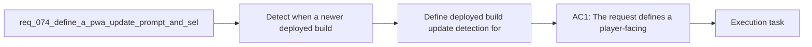

## item_279_define_deployed_build_update_detection_for_browser_and_installed_pwa_sessions - Define deployed build update detection for browser and installed PWA sessions
> From version: 0.5.1
> Schema version: 1.0
> Status: Ready
> Understanding: 93%
> Confidence: 90%
> Progress: 0%
> Complexity: Medium
> Theme: UI
> Reminder: Update status/understanding/confidence/progress and linked task references when you edit this doc.

# Problem
- Detect when a newer deployed build is available instead of leaving installed PWA users stuck on an older runtime until they manually close or refresh the app.
- Present a clear in-app update prompt, ideally as a modal, so the user understands that a newer version is ready and can choose when to apply it.
- Keep the update flow compatible with the current shell or DOM overlay posture instead of burying service-worker behavior in invisible background logic.
- Avoid surprise reloads during active play when a safer user-confirmed update path can preserve trust and reduce session disruption.
- The project already ships as a Vite PWA and currently uses `vite-plugin-pwa` with `registerType: "autoUpdate"` in `vite.config.ts`.
- That means the app can fetch a fresher service worker in the background, but the product does not yet expose a player-facing update flow that says:

# Scope
- In:
- Out:

# Acceptance criteria
- AC1: The request defines a player-facing update posture for deployed builds rather than relying only on background service-worker replacement.
- AC2: The request defines how the app detects that a newer build is ready to activate in both browser and installed PWA contexts.
- AC3: The request defines a shell-owned update prompt, ideally a modal, that clearly communicates:
- a new version is available
- the user can trigger the update
- what will happen when they confirm
- AC4: The request defines a safe activation posture that avoids surprise reloads during active runtime play unless an explicit forced-update case is later justified.
- AC5: The request defines how deferred updates remain discoverable after the user dismisses or postpones the first prompt.
- AC6: The request keeps update affordances in the DOM or shell layer rather than making them a world-space Pixi concern.
- AC7: The request defines validation for the update flow with at least:
- one browser-tab path
- one installed PWA path or closest reproducible approximation
- evidence that the refreshed session serves the new build
- AC8: The request stays compatible with the current static-hosted Vite PWA posture and does not require a backend release-control system.

# AC Traceability
- AC1 -> Scope: The request defines a player-facing update posture for deployed builds rather than relying only on background service-worker replacement.. Proof target: implementation notes, validation evidence, or task report.
- AC2 -> Scope: The request defines how the app detects that a newer build is ready to activate in both browser and installed PWA contexts.. Proof target: implementation notes, validation evidence, or task report.
- AC3 -> Scope: The request defines a shell-owned update prompt, ideally a modal, that clearly communicates:. Proof target: implementation notes, validation evidence, or task report.
- AC4 -> Scope: a new version is available. Proof target: implementation notes, validation evidence, or task report.
- AC5 -> Scope: the user can trigger the update. Proof target: implementation notes, validation evidence, or task report.
- AC6 -> Scope: what will happen when they confirm. Proof target: implementation notes, validation evidence, or task report.
- AC4 -> Scope: The request defines a safe activation posture that avoids surprise reloads during active runtime play unless an explicit forced-update case is later justified.. Proof target: implementation notes, validation evidence, or task report.
- AC5 -> Scope: The request defines how deferred updates remain discoverable after the user dismisses or postpones the first prompt.. Proof target: implementation notes, validation evidence, or task report.
- AC6 -> Scope: The request keeps update affordances in the DOM or shell layer rather than making them a world-space Pixi concern.. Proof target: implementation notes, validation evidence, or task report.
- AC7 -> Scope: The request defines validation for the update flow with at least:. Proof target: implementation notes, validation evidence, or task report.
- AC8 -> Scope: one browser-tab path. Proof target: implementation notes, validation evidence, or task report.
- AC9 -> Scope: one installed PWA path or closest reproducible approximation. Proof target: implementation notes, validation evidence, or task report.
- AC10 -> Scope: evidence that the refreshed session serves the new build. Proof target: implementation notes, validation evidence, or task report.
- AC8 -> Scope: The request stays compatible with the current static-hosted Vite PWA posture and does not require a backend release-control system.. Proof target: implementation notes, validation evidence, or task report.

# Decision framing
- Product framing: Required
- Product signals: conversion journey, navigation and discoverability
- Product follow-up: Create or link a product brief before implementation moves deeper into delivery.
- Architecture framing: Required
- Architecture signals: data model and persistence, contracts and integration, state and sync, delivery and operations
- Architecture follow-up: Create or link an architecture decision before irreversible implementation work starts.

# Links
- Product brief(s): (none yet)
- Architecture decision(s): `adr_017_lazy_load_pixi_runtime_behind_a_shell_owned_boot_boundary`
- Request: `req_074_define_a_pwa_update_prompt_and_self_refresh_posture_for_deployed_builds`
- Primary task(s): `task_058_orchestrate_post_0_5_1_follow_up_wave_for_updates_pickups_crystal_flow_and_hostile_pressure`

# AI Context
- Summary: Define a PWA update prompt and self-refresh posture for deployed builds
- Keywords: pwa, update, prompt, and, self-refresh, posture, for, deployed
- Use when: Use when framing scope, context, and acceptance checks for Define a PWA update prompt and self-refresh posture for deployed builds.
- Skip when: Skip when the work targets another feature, repository, or workflow stage.

# References
- `logics/skills/logics-ui-steering/SKILL.md`

# Priority
- Impact:
- Urgency:

# Notes
- Derived from request `req_074_define_a_pwa_update_prompt_and_self_refresh_posture_for_deployed_builds`.
- Source file: `logics/request/req_074_define_a_pwa_update_prompt_and_self_refresh_posture_for_deployed_builds.md`.
- Request context seeded into this backlog item from `logics/request/req_074_define_a_pwa_update_prompt_and_self_refresh_posture_for_deployed_builds.md`.
