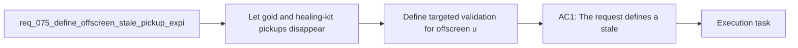

## item_284_define_targeted_validation_for_offscreen_utility_pickup_expiration_and_renewed_nearby_spawns - Define targeted validation for offscreen utility pickup expiration and renewed nearby spawns
> From version: 0.5.1
> Schema version: 1.0
> Status: Ready
> Understanding: 94%
> Confidence: 91%
> Progress: 0%
> Complexity: Medium
> Theme: Gameplay
> Reminder: Update status/understanding/confidence/progress and linked task references when you edit this doc.

# Problem
- Let `gold` and `healing-kit` pickups disappear when they have stayed outside the player's visible play space for too long, instead of letting stale drops block the nearby pickup cap indefinitely.
- Favor renewed pickup availability near the player over preserving long-forgotten offscreen utility drops that no longer contribute to readable run flow.
- Keep the behavior bounded to first-wave utility pickups so progression-critical drops such as crystals are not accidentally removed under the same rule.
- Make the expiration rule deterministic and explainable enough to validate in runtime tests and future tuning JSON.
- The current pickup loop already maintains a bounded nearby population and already removes pickups that drift beyond a hard despawn distance from the player.
- That solves the far-away-forever case, but it does not solve the more common gameplay issue:

# Scope
- In:
- Out:

# Acceptance criteria
- AC1: The request defines a stale utility-pickup expiration posture specifically for `gold` and `healing-kit` rather than for all pickup kinds.
- AC2: The request defines what too long outside view means in a deterministic and implementation-guiding way, such as a bounded invisible duration, visibility-window test, or equivalent reproducible rule.
- AC3: The request defines that stale offscreen utility pickups can be removed even when they have not crossed the broader distance-based despawn threshold.
- AC4: The request defines that pickup expiration frees the bounded nearby pickup population so new spawns can reappear closer to the player.
- AC5: The request explicitly keeps crystals or other progression-critical pickups out of this first expiration rule unless separately justified.
- AC6: The request defines validation for at least:
- one stale offscreen `gold` case
- one stale offscreen `healing-kit` case
- evidence that renewed nearby spawns become possible after expiration
- AC7: The request remains compatible with externalized gameplay tuning so thresholds can later move into JSON without redesigning the behavior.

# AC Traceability
- AC1 -> Scope: The request defines a stale utility-pickup expiration posture specifically for `gold` and `healing-kit` rather than for all pickup kinds.. Proof target: implementation notes, validation evidence, or task report.
- AC2 -> Scope: The request defines what too long outside view means in a deterministic and implementation-guiding way, such as a bounded invisible duration, visibility-window test, or equivalent reproducible rule.. Proof target: implementation notes, validation evidence, or task report.
- AC3 -> Scope: The request defines that stale offscreen utility pickups can be removed even when they have not crossed the broader distance-based despawn threshold.. Proof target: implementation notes, validation evidence, or task report.
- AC4 -> Scope: The request defines that pickup expiration frees the bounded nearby pickup population so new spawns can reappear closer to the player.. Proof target: implementation notes, validation evidence, or task report.
- AC5 -> Scope: The request explicitly keeps crystals or other progression-critical pickups out of this first expiration rule unless separately justified.. Proof target: implementation notes, validation evidence, or task report.
- AC6 -> Scope: The request defines validation for at least:. Proof target: implementation notes, validation evidence, or task report.
- AC7 -> Scope: one stale offscreen `gold` case. Proof target: implementation notes, validation evidence, or task report.
- AC8 -> Scope: one stale offscreen `healing-kit` case. Proof target: implementation notes, validation evidence, or task report.
- AC9 -> Scope: evidence that renewed nearby spawns become possible after expiration. Proof target: implementation notes, validation evidence, or task report.
- AC7 -> Scope: The request remains compatible with externalized gameplay tuning so thresholds can later move into JSON without redesigning the behavior.. Proof target: implementation notes, validation evidence, or task report.

# Decision framing
- Product framing: Not needed
- Product signals: (none detected)
- Product follow-up: No product brief follow-up is expected based on current signals.
- Architecture framing: Consider
- Architecture signals: data model and persistence
- Architecture follow-up: Review whether an architecture decision is needed before implementation becomes harder to reverse.

# Links
- Product brief(s): (none yet)
- Architecture decision(s): (none yet)
- Request: `req_075_define_offscreen_stale_pickup_expiration_for_gold_and_healing_kit_spawns`
- Primary task(s): `task_058_orchestrate_post_0_5_1_follow_up_wave_for_updates_pickups_crystal_flow_and_hostile_pressure`

# AI Context
- Summary: Define offscreen stale pickup expiration for gold and healing kit spawns
- Keywords: offscreen, stale, pickup, expiration, for, gold, and, healing
- Use when: Use when framing scope, context, and acceptance checks for Define offscreen stale pickup expiration for gold and healing kit spawns.
- Skip when: Skip when the work targets another feature, repository, or workflow stage.

# Priority
- Impact:
- Urgency:

# Notes
- Derived from request `req_075_define_offscreen_stale_pickup_expiration_for_gold_and_healing_kit_spawns`.
- Source file: `logics/request/req_075_define_offscreen_stale_pickup_expiration_for_gold_and_healing_kit_spawns.md`.
- Request context seeded into this backlog item from `logics/request/req_075_define_offscreen_stale_pickup_expiration_for_gold_and_healing_kit_spawns.md`.
