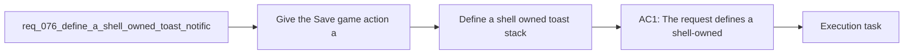

## item_285_define_a_shell_owned_toast_stack_and_bottom_left_viewport_anchoring_posture - Define a shell owned toast stack and bottom left viewport anchoring posture
> From version: 0.5.1
> Schema version: 1.0
> Status: Done
> Understanding: 95%
> Confidence: 92%
> Progress: 100%
> Complexity: Medium
> Theme: UI
> Reminder: Update status/understanding/confidence/progress and linked task references when you edit this doc.

# Problem
- Give the `Save game` action a clear user-facing success signal instead of silently writing the slot with no visible confirmation.
- Introduce a first shell-owned toast notification posture that can display short-lived feedback without interrupting runtime flow.
- Define a toast stack that appears in the bottom-left of the screen, stacks cleanly, and fades out after 5 seconds.
- Keep the first slice tightly scoped around save feedback while leaving room for later reuse by other shell-level success or error messages.
- The save/load flow already exists and `Save game` currently writes the active session into the single local slot from `AppShell`.
- From a product standpoint, the action works but does not feel trustworthy enough because it has no visible acknowledgement after the click.

# Scope
- In:
- Out:

# Acceptance criteria
- AC1: The request defines a shell-owned toast notification posture specifically strong enough to support `Save game` confirmation feedback.
- AC2: The request defines that a successful `Save game` action surfaces a visible toast confirmation instead of remaining silent.
- AC3: The request defines the first toast placement in the bottom-left corner of the screen.
- AC4: The request defines that multiple toasts stack cleanly rather than overlap or replace one another unpredictably.
- AC5: The request defines an automatic fade-out dismissal after 5 seconds for each toast.
- AC6: The request keeps toast ownership in the DOM or shell layer rather than introducing world-space Pixi notifications.
- AC7: The request defines a bounded first slice that does not widen into a full notification-center system, while still leaving future shell actions able to reuse the same toast posture later.
- AC8: The request defines validation for:
- one save-success toast path
- multiple stacked toast rendering
- timed disappearance after the 5-second lifetime

# AC Traceability
- AC1 -> Scope: The request defines a shell-owned toast notification posture specifically strong enough to support `Save game` confirmation feedback.. Proof target: implementation notes, validation evidence, or task report.
- AC2 -> Scope: The request defines that a successful `Save game` action surfaces a visible toast confirmation instead of remaining silent.. Proof target: implementation notes, validation evidence, or task report.
- AC3 -> Scope: The request defines the first toast placement in the bottom-left corner of the screen.. Proof target: implementation notes, validation evidence, or task report.
- AC4 -> Scope: The request defines that multiple toasts stack cleanly rather than overlap or replace one another unpredictably.. Proof target: implementation notes, validation evidence, or task report.
- AC5 -> Scope: The request defines an automatic fade-out dismissal after 5 seconds for each toast.. Proof target: implementation notes, validation evidence, or task report.
- AC6 -> Scope: The request keeps toast ownership in the DOM or shell layer rather than introducing world-space Pixi notifications.. Proof target: implementation notes, validation evidence, or task report.
- AC7 -> Scope: The request defines a bounded first slice that does not widen into a full notification-center system, while still leaving future shell actions able to reuse the same toast posture later.. Proof target: implementation notes, validation evidence, or task report.
- AC8 -> Scope: The request defines validation for:. Proof target: implementation notes, validation evidence, or task report.
- AC9 -> Scope: one save-success toast path. Proof target: implementation notes, validation evidence, or task report.
- AC10 -> Scope: multiple stacked toast rendering. Proof target: implementation notes, validation evidence, or task report.
- AC11 -> Scope: timed disappearance after the 5-second lifetime. Proof target: implementation notes, validation evidence, or task report.

# Decision framing
- Product framing: Consider
- Product signals: engagement loop
- Product follow-up: Review whether a product brief is needed before scope becomes harder to change.
- Architecture framing: Required
- Architecture signals: data model and persistence, contracts and integration, state and sync
- Architecture follow-up: Create or link an architecture decision before irreversible implementation work starts.

# Links
- Product brief(s): (none yet)
- Architecture decision(s): `adr_002_separate_react_shell_from_pixi_runtime_ownership`, `adr_016_define_shell_scene_state_and_meta_surface_ownership`
- Request: `req_076_define_a_shell_owned_toast_notification_posture_for_save_game_feedback`
- Primary task(s): `task_058_orchestrate_post_0_5_1_follow_up_wave_for_updates_pickups_crystal_flow_and_hostile_pressure`

# AI Context
- Summary: Define a shell-owned toast notification posture for save game feedback
- Keywords: shell-owned, toast, notification, posture, for, save, game, feedback
- Use when: Use when framing scope, context, and acceptance checks for Define a shell-owned toast notification posture for save game feedback.
- Skip when: Skip when the work targets another feature, repository, or workflow stage.
# References
- `logics/skills/logics-ui-steering/SKILL.md`

# Priority
- Impact:
- Urgency:

# Notes
- Derived from request `req_076_define_a_shell_owned_toast_notification_posture_for_save_game_feedback`.
- Source file: `logics/request/req_076_define_a_shell_owned_toast_notification_posture_for_save_game_feedback.md`.
- Request context seeded into this backlog item from `logics/request/req_076_define_a_shell_owned_toast_notification_posture_for_save_game_feedback.md`.
- Task `task_058_orchestrate_post_0_5_1_follow_up_wave_for_updates_pickups_crystal_flow_and_hostile_pressure` was finished via `logics_flow.py finish task` on 2026-03-28.
