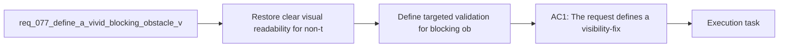

## item_290_define_targeted_validation_for_blocking_obstacle_visibility_and_map_readability - Define targeted validation for blocking obstacle visibility and map readability
> From version: 0.5.1
> Schema version: 1.0
> Status: Ready
> Understanding: 96%
> Confidence: 93%
> Progress: 0%
> Complexity: Medium
> Theme: UI
> Reminder: Update status/understanding/confidence/progress and linked task references when you edit this doc.

# Problem
- Restore clear visual readability for non-traversable blocking tiles, because their current presentation no longer communicates solidity reliably enough during play.
- Make blocking obstacles stand out explicitly from surrounding terrain instead of blending into dark or empty-looking cells.
- Adopt a vivid red obstacle treatment for this slice so impassable space becomes immediately legible to the player.
- Keep the change bounded to world readability and obstacle visibility rather than reopening obstacle-generation rules or collision behavior.
- The runtime already has a real obstacle layer and those tiles still block movement in gameplay.
- The current problem is not collision correctness.

# Scope
- In:
- Out:

# Acceptance criteria
- AC1: The request defines a visibility-fix slice for non-traversable obstacle tiles rather than reopening world-generation or collision semantics.
- AC2: The request defines that blocking obstacles must become clearly readable again during runtime play instead of remaining nearly black or visually absent.
- AC3: The request defines vivid red as the intended first corrective color direction for blocking tiles.
- AC4: The request defines that blocking obstacles must remain visually distinct from surrounding terrain across the current biome/debug palettes.
- AC5: The request keeps the change bounded to obstacle presentation and does not alter the underlying blocking-world contract.
- AC6: The request defines validation strong enough to show that:
- blocking tiles are visible again
- they no longer read as empty cells
- the red treatment remains legible against the world background

# AC Traceability
- AC1 -> Scope: The request defines a visibility-fix slice for non-traversable obstacle tiles rather than reopening world-generation or collision semantics.. Proof target: implementation notes, validation evidence, or task report.
- AC2 -> Scope: The request defines that blocking obstacles must become clearly readable again during runtime play instead of remaining nearly black or visually absent.. Proof target: implementation notes, validation evidence, or task report.
- AC3 -> Scope: The request defines vivid red as the intended first corrective color direction for blocking tiles.. Proof target: implementation notes, validation evidence, or task report.
- AC4 -> Scope: The request defines that blocking obstacles must remain visually distinct from surrounding terrain across the current biome/debug palettes.. Proof target: implementation notes, validation evidence, or task report.
- AC5 -> Scope: The request keeps the change bounded to obstacle presentation and does not alter the underlying blocking-world contract.. Proof target: implementation notes, validation evidence, or task report.
- AC6 -> Scope: The request defines validation strong enough to show that:. Proof target: implementation notes, validation evidence, or task report.
- AC7 -> Scope: blocking tiles are visible again. Proof target: implementation notes, validation evidence, or task report.
- AC8 -> Scope: they no longer read as empty cells. Proof target: implementation notes, validation evidence, or task report.
- AC9 -> Scope: the red treatment remains legible against the world background. Proof target: implementation notes, validation evidence, or task report.

# Decision framing
- Product framing: Not needed
- Product signals: (none detected)
- Product follow-up: No product brief follow-up is expected based on current signals.
- Architecture framing: Required
- Architecture signals: data model and persistence, contracts and integration
- Architecture follow-up: Create or link an architecture decision before irreversible implementation work starts.

# Links
- Product brief(s): (none yet)
- Architecture decision(s): `adr_032_separate_visual_terrain_blocking_obstacles_and_movement_surface_modifiers`
- Request: `req_077_define_a_vivid_blocking_obstacle_visibility_posture_for_non_traversable_world_tiles`
- Primary task(s): `task_058_orchestrate_post_0_5_1_follow_up_wave_for_updates_pickups_crystal_flow_and_hostile_pressure`

# AI Context
- Summary: Define a vivid blocking-obstacle visibility posture for non-traversable world tiles
- Keywords: vivid, blocking-obstacle, visibility, posture, for, non-traversable, world, tiles
- Use when: Use when framing scope, context, and acceptance checks for Define a vivid blocking-obstacle visibility posture for non-traversable world tiles.
- Skip when: Skip when the work targets another feature, repository, or workflow stage.

# References
- `logics/skills/logics-ui-steering/SKILL.md`

# Priority
- Impact:
- Urgency:

# Notes
- Derived from request `req_077_define_a_vivid_blocking_obstacle_visibility_posture_for_non_traversable_world_tiles`.
- Source file: `logics/request/req_077_define_a_vivid_blocking_obstacle_visibility_posture_for_non_traversable_world_tiles.md`.
- Request context seeded into this backlog item from `logics/request/req_077_define_a_vivid_blocking_obstacle_visibility_posture_for_non_traversable_world_tiles.md`.
