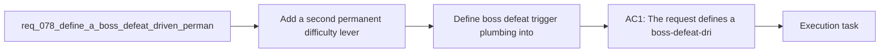

## item_292_define_boss_defeat_trigger_plumbing_into_permanent_run_pressure_escalation - Define boss defeat trigger plumbing into permanent run pressure escalation
> From version: 0.5.1
> Schema version: 1.0
> Status: Done
> Understanding: 96%
> Confidence: 93%
> Progress: 100%
> Complexity: High
> Theme: Combat
> Reminder: Update status/understanding/confidence/progress and linked task references when you edit this doc.

# Problem
- Add a second permanent difficulty lever that increases when the player defeats a boss, so survival cannot remain indefinitely stable even with a strong build.
- Make boss kills feel like meaningful run milestones that also tighten future pressure instead of acting only as isolated threat spikes.
- Keep the system legible by layering boss-defeat escalation on top of the existing authored time-phase model rather than replacing it.
- Preserve the fantasy that stronger players can delay collapse, while removing the possibility of a truly endless flat equilibrium.
- The current run already becomes harder over time through authored phases:
- - hostile max health increases

# Scope
- In:
- Out:

# Acceptance criteria
- AC1: The request defines a boss-defeat-driven escalation layer that stacks on top of the existing authored time-phase difficulty model instead of replacing it.
- AC2: The request defines that each boss defeat permanently increases one or more run difficulty multipliers for the remainder of the current run.
- AC3: The request defines the current authored mini-boss beat as a valid first trigger for this system unless later boss types are added.
- AC4: The request keeps the escalation legible by reusing existing pressure families such as hostile health, hostile contact damage, spawn cadence, or hostile population limits rather than introducing unrelated hidden difficulty mechanics.
- AC5: The request explicitly frames the design goal as delaying the inevitable rather than allowing a truly endless equilibrium once repeated bosses have been defeated.
- AC6: The request keeps scope bounded away from a full adaptive-director rewrite, meta-progression system, or broad rebalance of every combat subsystem.
- AC7: The request defines validation strong enough to show that:
- boss defeats permanently raise future pressure inside the same run
- the run still feels readable and authored
- stronger players can extend survival but not flatten the game into a stable endless state

# AC Traceability
- AC1 -> Scope: The request defines a boss-defeat-driven escalation layer that stacks on top of the existing authored time-phase difficulty model instead of replacing it.. Proof target: implementation notes, validation evidence, or task report.
- AC2 -> Scope: The request defines that each boss defeat permanently increases one or more run difficulty multipliers for the remainder of the current run.. Proof target: implementation notes, validation evidence, or task report.
- AC3 -> Scope: The request defines the current authored mini-boss beat as a valid first trigger for this system unless later boss types are added.. Proof target: implementation notes, validation evidence, or task report.
- AC4 -> Scope: The request keeps the escalation legible by reusing existing pressure families such as hostile health, hostile contact damage, spawn cadence, or hostile population limits rather than introducing unrelated hidden difficulty mechanics.. Proof target: implementation notes, validation evidence, or task report.
- AC5 -> Scope: The request explicitly frames the design goal as delaying the inevitable rather than allowing a truly endless equilibrium once repeated bosses have been defeated.. Proof target: implementation notes, validation evidence, or task report.
- AC6 -> Scope: The request keeps scope bounded away from a full adaptive-director rewrite, meta-progression system, or broad rebalance of every combat subsystem.. Proof target: implementation notes, validation evidence, or task report.
- AC7 -> Scope: The request defines validation strong enough to show that:. Proof target: implementation notes, validation evidence, or task report.
- AC8 -> Scope: boss defeats permanently raise future pressure inside the same run. Proof target: implementation notes, validation evidence, or task report.
- AC9 -> Scope: the run still feels readable and authored. Proof target: implementation notes, validation evidence, or task report.
- AC10 -> Scope: stronger players can extend survival but not flatten the game into a stable endless state. Proof target: implementation notes, validation evidence, or task report.

# Decision framing
- Product framing: Consider
- Product signals: experience scope
- Product follow-up: Review whether a product brief is needed before scope becomes harder to change.
- Architecture framing: Required
- Architecture signals: data model and persistence, delivery and operations
- Architecture follow-up: Create or link an architecture decision before irreversible implementation work starts.

# Links
- Product brief(s): `prod_016_time_owned_run_arc_and_authored_difficulty_phases`
- Architecture decision(s): `adr_047_structure_first_pass_run_difficulty_escalation_as_authored_time_phases`, `adr_049_structure_time_scaled_enemy_pressure_around_authored_population_opening_composition_tiers_and_mini_boss_beats`
- Request: `req_078_define_a_boss_defeat_driven_permanent_difficulty_escalation_layer`
- Primary task(s): `task_058_orchestrate_post_0_5_1_follow_up_wave_for_updates_pickups_crystal_flow_and_hostile_pressure`

# AI Context
- Summary: Define a boss-defeat-driven permanent difficulty escalation layer
- Keywords: boss-defeat-driven, permanent, difficulty, escalation, layer
- Use when: Use when framing scope, context, and acceptance checks for Define a boss-defeat-driven permanent difficulty escalation layer.
- Skip when: Skip when the work targets another feature, repository, or workflow stage.
# References
- `logics/skills/logics-ui-steering/SKILL.md`

# Priority
- Impact:
- Urgency:

# Notes
- Derived from request `req_078_define_a_boss_defeat_driven_permanent_difficulty_escalation_layer`.
- Source file: `logics/request/req_078_define_a_boss_defeat_driven_permanent_difficulty_escalation_layer.md`.
- Request context seeded into this backlog item from `logics/request/req_078_define_a_boss_defeat_driven_permanent_difficulty_escalation_layer.md`.
- Task `task_058_orchestrate_post_0_5_1_follow_up_wave_for_updates_pickups_crystal_flow_and_hostile_pressure` was finished via `logics_flow.py finish task` on 2026-03-28.
