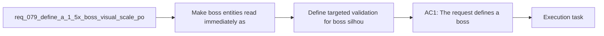

## item_295_define_targeted_validation_for_boss_silhouette_dominance_and_combat_readability - Define targeted validation for boss silhouette dominance and combat readability
> From version: 0.5.1
> Schema version: 1.0
> Status: Ready
> Understanding: 96%
> Confidence: 93%
> Progress: 0%
> Complexity: Low
> Theme: Combat
> Reminder: Update status/understanding/confidence/progress and linked task references when you edit this doc.

# Problem
- Make boss entities read immediately as bosses by giving them a much stronger on-screen size difference than standard hostile entities.
- Restore a clear visual hierarchy between regular enemies and boss threats, especially when they share similar base shapes or visual families.
- Adopt a first-pass target of `1.5x` boss scale relative to standard hostile rendering.
- Keep this slice focused on boss presence and readability rather than widening into a full hostile-art rework.
- The runtime already has a first-pass mini-boss profile through `watchglass-prime`.
- That entity is somewhat larger than regular hostiles through its footprint radius, but the difference is still not strong enough visually:

# Scope
- In:
- Out:

# Acceptance criteria
- AC1: The request defines a boss scale posture that makes boss-class hostiles render at `1.5x` the standard hostile scale.
- AC2: The request defines the current boss or mini-boss entity as the first concrete target for this visual-size contract.
- AC3: The request frames the change as a readability and threat-hierarchy improvement rather than a full hostile-art overhaul.
- AC4: The request keeps the first slice bounded so visual scaling can be delivered without automatically reopening boss AI, roster expansion, or broad movement/collision redesign.
- AC5: The request defines validation strong enough to show that bosses are visually identifiable faster and more reliably during active combat clutter.

# AC Traceability
- AC1 -> Scope: The request defines a boss scale posture that makes boss-class hostiles render at `1.5x` the standard hostile scale.. Proof target: implementation notes, validation evidence, or task report.
- AC2 -> Scope: The request defines the current boss or mini-boss entity as the first concrete target for this visual-size contract.. Proof target: implementation notes, validation evidence, or task report.
- AC3 -> Scope: The request frames the change as a readability and threat-hierarchy improvement rather than a full hostile-art overhaul.. Proof target: implementation notes, validation evidence, or task report.
- AC4 -> Scope: The request keeps the first slice bounded so visual scaling can be delivered without automatically reopening boss AI, roster expansion, or broad movement/collision redesign.. Proof target: implementation notes, validation evidence, or task report.
- AC5 -> Scope: The request defines validation strong enough to show that bosses are visually identifiable faster and more reliably during active combat clutter.. Proof target: implementation notes, validation evidence, or task report.

# Decision framing
- Product framing: Consider
- Product signals: experience scope
- Product follow-up: Review whether a product brief is needed before scope becomes harder to change.
- Architecture framing: Required
- Architecture signals: data model and persistence, contracts and integration, delivery and operations
- Architecture follow-up: Create or link an architecture decision before irreversible implementation work starts.

# Links
- Product brief(s): `prod_003_high_density_top_down_survival_action_direction`, `prod_016_time_owned_run_arc_and_authored_difficulty_phases`
- Architecture decision(s): `adr_049_structure_time_scaled_enemy_pressure_around_authored_population_opening_composition_tiers_and_mini_boss_beats`
- Request: `req_079_define_a_1_5x_boss_visual_scale_posture_for_runtime_hostiles`
- Primary task(s): `task_058_orchestrate_post_0_5_1_follow_up_wave_for_updates_pickups_crystal_flow_and_hostile_pressure`

# AI Context
- Summary: Define a 1.5x boss visual scale posture for runtime hostiles
- Keywords: boss, visual, scale, posture, runtime, hostiles
- Use when: Use when framing scope, context, and acceptance checks for Define a 1.5x boss visual scale posture for runtime hostiles.
- Skip when: Skip when the work targets another feature, repository, or workflow stage.

# References
- `logics/skills/logics-ui-steering/SKILL.md`

# Priority
- Impact:
- Urgency:

# Notes
- Derived from request `req_079_define_a_1_5x_boss_visual_scale_posture_for_runtime_hostiles`.
- Source file: `logics/request/req_079_define_a_1_5x_boss_visual_scale_posture_for_runtime_hostiles.md`.
- Request context seeded into this backlog item from `logics/request/req_079_define_a_1_5x_boss_visual_scale_posture_for_runtime_hostiles.md`.
