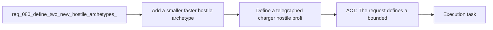

## item_297_define_a_telegraphed_charger_hostile_profile_with_one_second_wind_up_and_directional_sprint - Define a telegraphed charger hostile profile with one second wind up and directional sprint
> From version: 0.5.1
> Schema version: 1.0
> Status: Ready
> Understanding: 95%
> Confidence: 92%
> Progress: 0%
> Complexity: Medium
> Theme: Combat
> Reminder: Update status/understanding/confidence/progress and linked task references when you edit this doc.

# Problem
- Add a smaller, faster hostile archetype so the field pressure is not made only of medium-speed enemies with similar body presence.
- Add a telegraphed charger hostile archetype that creates burst threat through readable anticipation and avoidable commitment.
- Increase hostile variety through movement and attack posture differences rather than only through numeric scaling.
- Keep both additions bounded to readable first-pass archetypes that work within the current deterministic runtime combat model.
- The runtime already has:
- - a first hostile combat loop

# Scope
- In:
- Out:

# Acceptance criteria
- AC1: The request defines a bounded hostile-variety wave that introduces two new hostile archetypes without reopening the entire combat or AI stack.
- AC2: The request defines one hostile archetype that is approximately `0.5x` the standard hostile size and approximately `1.5x` the standard hostile movement speed.
- AC3: The request defines the small fast archetype strongly enough that it reads as a distinct mobility-pressure enemy rather than only a recolored stat variant.
- AC4: The request defines one hostile archetype that sometimes stops for about `1` second, visibly trembles during the stop, then performs a directional charge toward the player's last known direction.
- AC5: The request defines the charge as avoidable by player movement and explicitly avoids a perfectly homing burst that would feel unfair.
- AC6: The request keeps both archetypes compatible with the current authored hostile-pressure model rather than requiring a full encounter-director or animation-heavy rewrite.
- AC7: The request defines validation strong enough to show that:
- the small fast enemy is visibly smaller and meaningfully faster
- the charger telegraph is readable before the burst starts
- the charge behaves like a committed sprint in one direction
- the player can avoid the charge through timing and movement

# AC Traceability
- AC1 -> Scope: The request defines a bounded hostile-variety wave that introduces two new hostile archetypes without reopening the entire combat or AI stack.. Proof target: implementation notes, validation evidence, or task report.
- AC2 -> Scope: The request defines one hostile archetype that is approximately `0.5x` the standard hostile size and approximately `1.5x` the standard hostile movement speed.. Proof target: implementation notes, validation evidence, or task report.
- AC3 -> Scope: The request defines the small fast archetype strongly enough that it reads as a distinct mobility-pressure enemy rather than only a recolored stat variant.. Proof target: implementation notes, validation evidence, or task report.
- AC4 -> Scope: The request defines one hostile archetype that sometimes stops for about `1` second, visibly trembles during the stop, then performs a directional charge toward the player's last known direction.. Proof target: implementation notes, validation evidence, or task report.
- AC5 -> Scope: The request defines the charge as avoidable by player movement and explicitly avoids a perfectly homing burst that would feel unfair.. Proof target: implementation notes, validation evidence, or task report.
- AC6 -> Scope: The request keeps both archetypes compatible with the current authored hostile-pressure model rather than requiring a full encounter-director or animation-heavy rewrite.. Proof target: implementation notes, validation evidence, or task report.
- AC7 -> Scope: The request defines validation strong enough to show that:. Proof target: implementation notes, validation evidence, or task report.
- AC8 -> Scope: the small fast enemy is visibly smaller and meaningfully faster. Proof target: implementation notes, validation evidence, or task report.
- AC9 -> Scope: the charger telegraph is readable before the burst starts. Proof target: implementation notes, validation evidence, or task report.
- AC10 -> Scope: the charge behaves like a committed sprint in one direction. Proof target: implementation notes, validation evidence, or task report.
- AC11 -> Scope: the player can avoid the charge through timing and movement. Proof target: implementation notes, validation evidence, or task report.

# Decision framing
- Product framing: Required
- Product signals: experience scope
- Product follow-up: Create or link a product brief before implementation moves deeper into delivery.
- Architecture framing: Required
- Architecture signals: data model and persistence, contracts and integration, delivery and operations
- Architecture follow-up: Create or link an architecture decision before irreversible implementation work starts.

# Links
- Product brief(s): `prod_003_high_density_top_down_survival_action_direction`, `prod_016_time_owned_run_arc_and_authored_difficulty_phases`
- Architecture decision(s): `adr_033_adopt_deterministic_movement_oriented_pseudo_physics_instead_of_a_full_physics_engine`, `adr_049_structure_time_scaled_enemy_pressure_around_authored_population_opening_composition_tiers_and_mini_boss_beats`
- Request: `req_080_define_two_new_hostile_archetypes_for_fast_skirmish_and_telegraphed_charge_pressure`
- Primary task(s): `task_058_orchestrate_post_0_5_1_follow_up_wave_for_updates_pickups_crystal_flow_and_hostile_pressure`

# AI Context
- Summary: Define two new hostile archetypes for fast skirmish and telegraphed charge pressure
- Keywords: hostile, archetypes, fast, skirmish, telegraphed, charge, pressure
- Use when: Use when framing scope, context, and acceptance checks for Define two new hostile archetypes for fast skirmish and telegraphed charge pressure.
- Skip when: Skip when the work targets another feature, repository, or workflow stage.

# Priority
- Impact:
- Urgency:

# Notes
- Derived from request `req_080_define_two_new_hostile_archetypes_for_fast_skirmish_and_telegraphed_charge_pressure`.
- Source file: `logics/request/req_080_define_two_new_hostile_archetypes_for_fast_skirmish_and_telegraphed_charge_pressure.md`.
- Request context seeded into this backlog item from `logics/request/req_080_define_two_new_hostile_archetypes_for_fast_skirmish_and_telegraphed_charge_pressure.md`.
