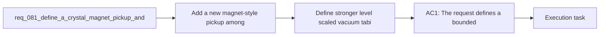

## item_300_define_stronger_level_scaled_vacuum_tabi_crystal_attraction_reach - Define stronger level scaled vacuum tabi crystal attraction reach
> From version: 0.5.1
> Schema version: 1.0
> Status: Ready
> Understanding: 95%
> Confidence: 92%
> Progress: 0%
> Complexity: Medium
> Theme: Gameplay
> Reminder: Update status/understanding/confidence/progress and linked task references when you edit this doc.

# Problem
- Add a new magnet-style pickup among world utility pickups so the player can trigger a full-map XP crystal vacuum moment.
- Strengthen the existing crystal-attraction passive so pickup reach scales more meaningfully with level instead of feeling too modest.
- Rework XP crystal consumption so crystals are first pulled toward the player before being consumed, instead of disappearing instantly on proximity.
- Unify the attraction-first behavior across normal pickup reach, the stronger passive radius, and the new magnet bonus so crystal collection feels consistent and legible.
- The runtime already has:
- - XP crystals dropped by defeated hostiles

# Scope
- In:
- Out:

# Acceptance criteria
- AC1: The request defines a bounded XP-crystal collection wave that introduces a new magnet pickup plus an attraction-first collection posture.
- AC2: The request defines a new `magnet` pickup that, when collected, attracts all XP crystals currently present on the map toward the player.
- AC3: The request defines that magnet-triggered crystal collection still resolves through crystal travel toward the player rather than instant XP grant at crystal origin points.
- AC4: The request defines that the existing crystal-attraction passive becomes stronger and scales its attraction reach more meaningfully by level.
- AC5: The request defines that normal XP crystal collection no longer resolves as immediate proximity deletion, but instead pulls crystals toward the player before they are consumed.
- AC6: The request defines one shared attraction-first posture for standard nearby collection, passive-extended collection, and magnet-triggered collection.
- AC7: The request keeps scope intentionally bounded to XP crystals and does not automatically widen the same travel-animation contract to `gold` or `healing-kit`.
- AC8: The request defines validation strong enough to show that:
- nearby crystals visibly move toward the player before XP is granted
- higher `vacuum-tabi` levels produce clearly stronger attraction reach
- magnet pickup collection pulls distant crystals from the whole active map space
- XP is granted on crystal arrival rather than at attraction trigger time

# AC Traceability
- AC1 -> Scope: The request defines a bounded XP-crystal collection wave that introduces a new magnet pickup plus an attraction-first collection posture.. Proof target: implementation notes, validation evidence, or task report.
- AC2 -> Scope: The request defines a new `magnet` pickup that, when collected, attracts all XP crystals currently present on the map toward the player.. Proof target: implementation notes, validation evidence, or task report.
- AC3 -> Scope: The request defines that magnet-triggered crystal collection still resolves through crystal travel toward the player rather than instant XP grant at crystal origin points.. Proof target: implementation notes, validation evidence, or task report.
- AC4 -> Scope: The request defines that the existing crystal-attraction passive becomes stronger and scales its attraction reach more meaningfully by level.. Proof target: implementation notes, validation evidence, or task report.
- AC5 -> Scope: The request defines that normal XP crystal collection no longer resolves as immediate proximity deletion, but instead pulls crystals toward the player before they are consumed.. Proof target: implementation notes, validation evidence, or task report.
- AC6 -> Scope: The request defines one shared attraction-first posture for standard nearby collection, passive-extended collection, and magnet-triggered collection.. Proof target: implementation notes, validation evidence, or task report.
- AC7 -> Scope: The request keeps scope intentionally bounded to XP crystals and does not automatically widen the same travel-animation contract to `gold` or `healing-kit`.. Proof target: implementation notes, validation evidence, or task report.
- AC8 -> Scope: The request defines validation strong enough to show that:. Proof target: implementation notes, validation evidence, or task report.
- AC9 -> Scope: nearby crystals visibly move toward the player before XP is granted. Proof target: implementation notes, validation evidence, or task report.
- AC10 -> Scope: higher `vacuum-tabi` levels produce clearly stronger attraction reach. Proof target: implementation notes, validation evidence, or task report.
- AC11 -> Scope: magnet pickup collection pulls distant crystals from the whole active map space. Proof target: implementation notes, validation evidence, or task report.
- AC12 -> Scope: XP is granted on crystal arrival rather than at attraction trigger time. Proof target: implementation notes, validation evidence, or task report.

# Decision framing
- Product framing: Not needed
- Product signals: (none detected)
- Product follow-up: No product brief follow-up is expected based on current signals.
- Architecture framing: Required
- Architecture signals: data model and persistence, contracts and integration
- Architecture follow-up: Create or link an architecture decision before irreversible implementation work starts.

# Links
- Product brief(s): `prod_007_foundational_passive_item_direction_for_emberwake`
- Architecture decision(s): `adr_033_adopt_deterministic_movement_oriented_pseudo_physics_instead_of_a_full_physics_engine`, `adr_038_split_entity_player_rendering_into_stable_geometry_and_transient_combat_overlays`
- Request: `req_081_define_a_crystal_magnet_pickup_and_attraction_first_xp_crystal_collection_posture`
- Primary task(s): `task_058_orchestrate_post_0_5_1_follow_up_wave_for_updates_pickups_crystal_flow_and_hostile_pressure`

# AI Context
- Summary: Define a crystal magnet pickup and attraction first XP crystal collection posture
- Keywords: crystal, magnet, pickup, attraction, xp, collection, posture
- Use when: Use when framing scope, context, and acceptance checks for Define a crystal magnet pickup and attraction first XP crystal collection posture.
- Skip when: Skip when the work targets another feature, repository, or workflow stage.

# Priority
- Impact:
- Urgency:

# Notes
- Derived from request `req_081_define_a_crystal_magnet_pickup_and_attraction_first_xp_crystal_collection_posture`.
- Source file: `logics/request/req_081_define_a_crystal_magnet_pickup_and_attraction_first_xp_crystal_collection_posture.md`.
- Request context seeded into this backlog item from `logics/request/req_081_define_a_crystal_magnet_pickup_and_attraction_first_xp_crystal_collection_posture.md`.
