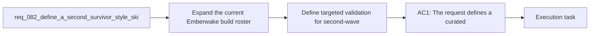

## item_309_define_targeted_validation_for_second_wave_survivor_skill_roster_distinctiveness_and_balance_posture - Define targeted validation for second-wave survivor skill roster distinctiveness and balance posture
> From version: 0.5.1
> Schema version: 1.0
> Status: Done
> Understanding: 98%
> Confidence: 95%
> Progress: 100%
> Complexity: High
> Theme: Combat
> Reminder: Update status/understanding/confidence/progress and linked task references when you edit this doc.
> Related task: `task_059_orchestrate_second_wave_skills_fusion_completion_meta_progression_hourglass_pickup_and_game_over_damage_share_polish`

# Problem
- Expand the current Emberwake build roster with a second curated wave of survivor-style skills so runs can support more distinct build fantasies than the first playable roster alone.
- Add new combat roles that are not limited to straightforward direct damage, including orbit control, chain clear, trail zoning, burst defense, pickup economy, retaliation, and boss-focused pressure.
- Make the build system feel deeper and more replayable by introducing active and passive skills that support different styles of survival instead of only stronger versions of the same loop.
- Keep the wave compatible with the current deterministic runtime, active/passive slot model, and authored fusion posture rather than reopening the entire combat architecture.
- The project already has:
- - a first playable curated build roster

# Scope
- In:
- Out:

# Acceptance criteria
- AC1: The request defines a curated second-wave skill-roster expansion rather than an unbounded list of future ideas.
- AC2: The request defines a concrete active-skill target roster that includes `Orbiting Blades`, `Chain Lightning`, `Burning Trail`, `Boomerang Arc`, `Halo Burst`, `Frost Nova`, and `Vacuum Pulse`.
- AC3: The request defines a concrete passive-skill target roster that includes `Thorn Mail`, `Execution Sigil`, `Greed Engine`, `Boss Hunter`, and `Emergency Aegis`.
- AC4: The request defines each proposed skill strongly enough that its gameplay role is clear, including at least one of the following role families:
- proximity control
- crowd clear
- route zoning
- crowd control
- economy
- survivability
- boss specialization
- AC5: The request keeps the wave compatible with the existing Emberwake active-slot and passive-slot build model instead of requiring a full roster-system redesign.
- AC6: The request defines the wave as compatible with future fusion follow-up without requiring every new skill to ship with a fusion in the same slice.
- AC7: The request keeps the wave compatible with the current deterministic runtime architecture and explicitly avoids reopening combat into a broad unrestricted projectile or status-system rewrite.
- AC8: The request defines rollout expectations strong enough that the wave can later be split into coherent backlog slices by role or implementation seam rather than one giant delivery item.
- AC9: The request defines validation expectations strong enough to later prove that:
- each skill reads as a distinct build role
- the new roster broadens viable run archetypes
- economy or survivability additions do not crowd out offensive picks by default
- boss-focused and crowd-focused picks both have a meaningful place in the build ecosystem

# AC Traceability
- AC1 -> Scope: The request defines a curated second-wave skill-roster expansion rather than an unbounded list of future ideas.. Proof: To be demonstrated during implementation validation.
- AC2 -> Scope: The request defines a concrete active-skill target roster that includes `Orbiting Blades`, `Chain Lightning`, `Burning Trail`, `Boomerang Arc`, `Halo Burst`, `Frost Nova`, and `Vacuum Pulse`.. Proof: To be demonstrated during implementation validation.
- AC3 -> Scope: The request defines a concrete passive-skill target roster that includes `Thorn Mail`, `Execution Sigil`, `Greed Engine`, `Boss Hunter`, and `Emergency Aegis`.. Proof: To be demonstrated during implementation validation.
- AC4 -> Scope: The request defines each proposed skill strongly enough that its gameplay role is clear, including at least one of the following role families:. Proof: To be demonstrated during implementation validation.
- AC5 -> Scope: proximity control. Proof: To be demonstrated during implementation validation.
- AC6 -> Scope: crowd clear. Proof: To be demonstrated during implementation validation.
- AC7 -> Scope: route zoning. Proof: To be demonstrated during implementation validation.
- AC8 -> Scope: crowd control. Proof: To be demonstrated during implementation validation.
- AC9 -> Scope: economy. Proof: To be demonstrated during implementation validation.
- AC10 -> Scope: survivability. Proof: To be demonstrated during implementation validation.
- AC11 -> Scope: boss specialization. Proof: To be demonstrated during implementation validation.
- AC5 -> Scope: The request keeps the wave compatible with the existing Emberwake active-slot and passive-slot build model instead of requiring a full roster-system redesign.. Proof: To be demonstrated during implementation validation.
- AC6 -> Scope: The request defines the wave as compatible with future fusion follow-up without requiring every new skill to ship with a fusion in the same slice.. Proof: To be demonstrated during implementation validation.
- AC7 -> Scope: The request keeps the wave compatible with the current deterministic runtime architecture and explicitly avoids reopening combat into a broad unrestricted projectile or status-system rewrite.. Proof: To be demonstrated during implementation validation.
- AC8 -> Scope: The request defines rollout expectations strong enough that the wave can later be split into coherent backlog slices by role or implementation seam rather than one giant delivery item.. Proof: To be demonstrated during implementation validation.
- AC9 -> Scope: The request defines validation expectations strong enough to later prove that:. Proof: To be demonstrated during implementation validation.
- AC12 -> Scope: each skill reads as a distinct build role. Proof: To be demonstrated during implementation validation.
- AC13 -> Scope: the new roster broadens viable run archetypes. Proof: To be demonstrated during implementation validation.
- AC14 -> Scope: economy or survivability additions do not crowd out offensive picks by default. Proof: To be demonstrated during implementation validation.
- AC15 -> Scope: boss-focused and crowd-focused picks both have a meaningful place in the build ecosystem. Proof: To be demonstrated during implementation validation.

# Decision framing
- Product framing: Not needed
- Product signals: (none detected)
- Product follow-up: No product brief follow-up is expected based on current signals.
- Architecture framing: Required
- Architecture signals: data model and persistence, delivery and operations
- Architecture follow-up: Create or link an architecture decision before irreversible implementation work starts.

# Links
- Product brief(s): `prod_006_foundational_survivor_weapon_roster_for_emberwake`, `prod_007_foundational_passive_item_direction_for_emberwake`, `prod_008_active_passive_fusion_direction_for_emberwake`, `prod_009_level_up_slots_and_run_progression_model_for_emberwake`, `prod_010_first_playable_techno_shinobi_build_content_and_progression_defaults`, `prod_016_time_owned_run_arc_and_authored_difficulty_phases`
- Architecture decision(s): `adr_039_structure_the_first_survivor_build_loop_around_separate_active_and_passive_slots`, `adr_040_use_curated_active_passive_fusions_as_the_foundational_build_payoff_layer`, `adr_041_lock_the_first_playable_survivor_content_wave_to_one_character_and_a_small_curated_techno_shinobi_roster`, `adr_042_separate_weapon_simulation_from_transient_combat_skill_feedback_presentation`
- Request: `req_082_define_a_second_survivor_style_skill_roster_expansion_wave_for_combat_control_economy_and_survivability`
- Primary task(s): (none yet)

# AI Context
- Summary: Define a second survivor style skill roster expansion wave for combat control economy and survivability
- Keywords: survivor, skills, roster, expansion, active, passive, economy, survivability
- Use when: Use when framing scope, context, and acceptance checks for Define a second survivor style skill roster expansion wave for combat control economy and survivability.
- Skip when: Skip when the work targets another feature, repository, or workflow stage.

# Priority
- Impact:
- Urgency:

# Notes
- Derived from request `req_082_define_a_second_survivor_style_skill_roster_expansion_wave_for_combat_control_economy_and_survivability`.
- Source file: `logics/request/req_082_define_a_second_survivor_style_skill_roster_expansion_wave_for_combat_control_economy_and_survivability.md`.
- Request context seeded into this backlog item from `logics/request/req_082_define_a_second_survivor_style_skill_roster_expansion_wave_for_combat_control_economy_and_survivability.md`.
