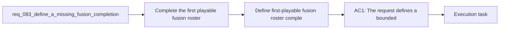

## item_312_define_first_playable_fusion_roster_completion_posture_for_remaining_passive_keys_and_chest_readiness - Define first-playable fusion roster completion posture for remaining passive keys and chest readiness
> From version: 0.5.1
> Schema version: 1.0
> Status: Done
> Understanding: 98%
> Confidence: 95%
> Progress: 100%
> Complexity: Medium
> Theme: Combat
> Reminder: Update status/understanding/confidence/progress and linked task references when you edit this doc.
> Related task: `task_059_orchestrate_second_wave_skills_fusion_completion_meta_progression_hourglass_pickup_and_game_over_damage_share_polish`

# Problem
- Complete the first playable fusion roster so the remaining active and passive skills that currently have no fusion payoff are no longer second-class choices.
- Add bounded curated fusions for the two missing first-pass pairing gaps:
- `Cinder Arc` with `Echo Thread`
- `Null Canister` with `Vacuum Tabi`
- Reinforce the build-system promise that curated active-plus-passive pairings create a meaningful payoff layer instead of leaving obvious roster holes.
- Improve build excitement and decision clarity by ensuring the remaining first-wave combat and economy skills can also culminate in a named fusion state.
- The current first playable build roster already contains:
- - `6` active weapons

# Scope
- In:
- Out:

# Acceptance criteria
- AC1: The request defines a bounded fusion-completion wave for the remaining uncovered first playable active and passive pairings rather than a broad fusion-system redesign.
- AC2: The request defines a new curated fusion pairing for `Cinder Arc` and `Echo Thread`, with `Afterimage Pyre` as the target fusion identity.
- AC3: The request defines a new curated fusion pairing for `Null Canister` and `Vacuum Tabi`, with `Event Horizon` as the target fusion identity.
- AC4: The request defines each new fusion strongly enough that it reads as an evolution of both of its source skills, not only as a generic damage increase.
- AC5: The request keeps both additions compatible with the current one-active plus one-passive curated fusion model and chest-driven fusion resolution posture.
- AC6: The request defines the wave as a completion pass for the first playable roster, such that the remaining uncovered first-wave passives now open a fusion path.
- AC7: The request keeps the slice bounded to the current first playable roster and does not widen into second-wave skill fusion planning.
- AC8: The request defines validation expectations strong enough to later prove that:
- `Afterimage Pyre` is readable as a duration or lingering-pressure evolution of `Cinder Arc` and `Echo Thread`
- `Event Horizon` is readable as a vacuum or collapse evolution of `Null Canister` and `Vacuum Tabi`
- the two added fusions make the first playable roster feel more structurally complete
- the new fusions integrate into existing fusion readiness and chest payoff rules without special-case redesign

# AC Traceability
- AC1 -> Scope: The request defines a bounded fusion-completion wave for the remaining uncovered first playable active and passive pairings rather than a broad fusion-system redesign.. Proof: To be demonstrated during implementation validation.
- AC2 -> Scope: The request defines a new curated fusion pairing for `Cinder Arc` and `Echo Thread`, with `Afterimage Pyre` as the target fusion identity.. Proof: To be demonstrated during implementation validation.
- AC3 -> Scope: The request defines a new curated fusion pairing for `Null Canister` and `Vacuum Tabi`, with `Event Horizon` as the target fusion identity.. Proof: To be demonstrated during implementation validation.
- AC4 -> Scope: The request defines each new fusion strongly enough that it reads as an evolution of both of its source skills, not only as a generic damage increase.. Proof: To be demonstrated during implementation validation.
- AC5 -> Scope: The request keeps both additions compatible with the current one-active plus one-passive curated fusion model and chest-driven fusion resolution posture.. Proof: To be demonstrated during implementation validation.
- AC6 -> Scope: The request defines the wave as a completion pass for the first playable roster, such that the remaining uncovered first-wave passives now open a fusion path.. Proof: To be demonstrated during implementation validation.
- AC7 -> Scope: The request keeps the slice bounded to the current first playable roster and does not widen into second-wave skill fusion planning.. Proof: To be demonstrated during implementation validation.
- AC8 -> Scope: The request defines validation expectations strong enough to later prove that:. Proof: To be demonstrated during implementation validation.
- AC9 -> Scope: `Afterimage Pyre` is readable as a duration or lingering-pressure evolution of `Cinder Arc` and `Echo Thread`. Proof: To be demonstrated during implementation validation.
- AC10 -> Scope: `Event Horizon` is readable as a vacuum or collapse evolution of `Null Canister` and `Vacuum Tabi`. Proof: To be demonstrated during implementation validation.
- AC11 -> Scope: the two added fusions make the first playable roster feel more structurally complete. Proof: To be demonstrated during implementation validation.
- AC12 -> Scope: the new fusions integrate into existing fusion readiness and chest payoff rules without special-case redesign. Proof: To be demonstrated during implementation validation.

# Decision framing
- Product framing: Not needed
- Product signals: (none detected)
- Product follow-up: No product brief follow-up is expected based on current signals.
- Architecture framing: Required
- Architecture signals: data model and persistence, contracts and integration, state and sync
- Architecture follow-up: Create or link an architecture decision before irreversible implementation work starts.

# Links
- Product brief(s): `prod_006_foundational_survivor_weapon_roster_for_emberwake`, `prod_007_foundational_passive_item_direction_for_emberwake`, `prod_008_active_passive_fusion_direction_for_emberwake`, `prod_010_first_playable_techno_shinobi_build_content_and_progression_defaults`
- Architecture decision(s): `adr_039_structure_the_first_survivor_build_loop_around_separate_active_and_passive_slots`, `adr_040_use_curated_active_passive_fusions_as_the_foundational_build_payoff_layer`, `adr_041_lock_the_first_playable_survivor_content_wave_to_one_character_and_a_small_curated_techno_shinobi_roster`
- Request: `req_083_define_a_missing_fusion_completion_wave_for_the_remaining_first_playable_active_passive_pairings`
- Primary task(s): (none yet)

# AI Context
- Summary: Define a missing fusion completion wave for the remaining first playable active passive pairings
- Keywords: fusion, completion, first playable, cinder arc, echo thread, null canister, vacuum tabi
- Use when: Use when framing scope, context, and acceptance checks for Define a missing fusion completion wave for the remaining first playable active passive pairings.
- Skip when: Skip when the work targets another feature, repository, or workflow stage.

# References
- `logics/skills/logics-ui-steering/SKILL.md`

# Priority
- Impact:
- Urgency:

# Notes
- Derived from request `req_083_define_a_missing_fusion_completion_wave_for_the_remaining_first_playable_active_passive_pairings`.
- Source file: `logics/request/req_083_define_a_missing_fusion_completion_wave_for_the_remaining_first_playable_active_passive_pairings.md`.
- Request context seeded into this backlog item from `logics/request/req_083_define_a_missing_fusion_completion_wave_for_the_remaining_first_playable_active_passive_pairings.md`.
