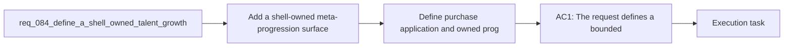

## item_317_define_purchase_application_and_owned_progression_integration_across_the_shell_and_runtime - Define purchase application and owned progression integration across the shell and runtime
> From version: 0.5.1
> Schema version: 1.0
> Status: Done
> Understanding: 97%
> Confidence: 94%
> Progress: 100%
> Complexity: High
> Theme: Meta progression
> Reminder: Update status/understanding/confidence/progress and linked task references when you edit this doc.

# Problem
- Add a shell-owned meta-progression surface so runs feed into a longer-term progression loop instead of ending only in immediate run loss or success.
- Turn persistent currency into meaningful long-term value through two clearly separated lanes:
- `Shop` for unlockable content
- `Talents` for permanent account or profile bonuses
- Define a first bounded roster of permanent talent upgrades that improve survivability, economy, pickup flow, and mobility without overwhelming the player.
- Define a first bounded unlock shop that can progressively open new skills, new fusions, and new pickup or bonus archetypes into the run pool.
- Require escalating talent costs per rank so each next permanent upgrade tier is more expensive than the previous one and late progression has real weight.
- The project already has:
- - a shell-owned main menu and menu-entry posture

# Scope
- In:
- Out:

# Acceptance criteria
- AC1: The request defines a bounded shell-owned meta-progression surface reachable from the menu flow rather than a broad full-game progression redesign.
- AC2: The request defines two clearly separated progression lanes:
- `Shop` for unlockable content
- `Talents` for permanent ranked bonuses
- AC3: The request defines the first `Shop` lane strongly enough that it can unlock at least:
- new skills into the run pool
- new fusions into the run pool
- new pickup or bonus archetypes into the run pool
- AC4: The request defines the first `Talents` lane strongly enough that it includes at least:
- `+Max HP`
- `+Pickup Radius`
- `+Gold Gain`
- `+XP Gain`
- `+Move Speed`
- a late expensive `Revive` or `Shield` lane
- AC5: The request defines that talent upgrades are rank-based and that each next rank costs more than the previous one rather than using a flat price per level.
- AC6: The request defines the first wave as locally persisted progression data compatible with the existing frontend-only save strategy.
- AC7: The request keeps the progression surface shell-owned and does not reopen ownership around Pixi runtime UI for this feature.
- AC8: The request keeps the first wave bounded, with a small curated set of talents and unlockables rather than an oversized branching tree.
- AC9: The request defines validation expectations strong enough to later prove that:
- purchases persist correctly
- locked content is not available before unlock
- purchased content becomes available after unlock
- talent costs escalate correctly by rank
- powerful survivability talents remain late and expensive enough not to trivialize the early meta loop

# AC Traceability
- AC1 -> Scope: The request defines a bounded shell-owned meta-progression surface reachable from the menu flow rather than a broad full-game progression redesign.. Proof: To be demonstrated during implementation validation.
- AC2 -> Scope: The request defines two clearly separated progression lanes:. Proof: To be demonstrated during implementation validation.
- AC3 -> Scope: `Shop` for unlockable content. Proof: To be demonstrated during implementation validation.
- AC4 -> Scope: `Talents` for permanent ranked bonuses. Proof: To be demonstrated during implementation validation.
- AC3 -> Scope: The request defines the first `Shop` lane strongly enough that it can unlock at least:. Proof: To be demonstrated during implementation validation.
- AC5 -> Scope: new skills into the run pool. Proof: To be demonstrated during implementation validation.
- AC6 -> Scope: new fusions into the run pool. Proof: To be demonstrated during implementation validation.
- AC7 -> Scope: new pickup or bonus archetypes into the run pool. Proof: To be demonstrated during implementation validation.
- AC4 -> Scope: The request defines the first `Talents` lane strongly enough that it includes at least:. Proof: To be demonstrated during implementation validation.
- AC8 -> Scope: `+Max HP`. Proof: To be demonstrated during implementation validation.
- AC9 -> Scope: `+Pickup Radius`. Proof: To be demonstrated during implementation validation.
- AC10 -> Scope: `+Gold Gain`. Proof: To be demonstrated during implementation validation.
- AC11 -> Scope: `+XP Gain`. Proof: To be demonstrated during implementation validation.
- AC12 -> Scope: `+Move Speed`. Proof: To be demonstrated during implementation validation.
- AC13 -> Scope: a late expensive `Revive` or `Shield` lane. Proof: To be demonstrated during implementation validation.
- AC5 -> Scope: The request defines that talent upgrades are rank-based and that each next rank costs more than the previous one rather than using a flat price per level.. Proof: To be demonstrated during implementation validation.
- AC6 -> Scope: The request defines the first wave as locally persisted progression data compatible with the existing frontend-only save strategy.. Proof: To be demonstrated during implementation validation.
- AC7 -> Scope: The request keeps the progression surface shell-owned and does not reopen ownership around Pixi runtime UI for this feature.. Proof: To be demonstrated during implementation validation.
- AC8 -> Scope: The request keeps the first wave bounded, with a small curated set of talents and unlockables rather than an oversized branching tree.. Proof: To be demonstrated during implementation validation.
- AC9 -> Scope: The request defines validation expectations strong enough to later prove that:. Proof: To be demonstrated during implementation validation.
- AC14 -> Scope: purchases persist correctly. Proof: To be demonstrated during implementation validation.
- AC15 -> Scope: locked content is not available before unlock. Proof: To be demonstrated during implementation validation.
- AC16 -> Scope: purchased content becomes available after unlock. Proof: To be demonstrated during implementation validation.
- AC17 -> Scope: talent costs escalate correctly by rank. Proof: To be demonstrated during implementation validation.
- AC18 -> Scope: powerful survivability talents remain late and expensive enough not to trivialize the early meta loop. Proof: To be demonstrated during implementation validation.

# Decision framing
- Product framing: Required
- Product signals: pricing and packaging, navigation and discoverability, engagement loop, experience scope
- Product follow-up: Create or link a product brief before implementation moves deeper into delivery.
- Architecture framing: Required
- Architecture signals: data model and persistence, contracts and integration, state and sync, delivery and operations
- Architecture follow-up: Create or link an architecture decision before irreversible implementation work starts.

# Links
- Product brief(s): `prod_009_level_up_slots_and_run_progression_model_for_emberwake`, `prod_010_first_playable_techno_shinobi_build_content_and_progression_defaults`, `prod_013_techno_shinobi_runtime_hud_and_menu_entry_direction`, `prod_015_post_run_outcome_analysis_direction_for_skill_performance`
- Architecture decision(s): `adr_016_define_shell_scene_state_and_meta_surface_ownership`, `adr_022_keep_product_meta_flow_shell_owned_while_runtime_state_remains_game_preserved`, `adr_045_model_grimoire_and_bestiary_as_shell_owned_discovery_gated_archive_scenes`
- Request: `req_084_define_a_shell_owned_talent_growth_and_unlock_shop_progression_surface`
- Primary task(s): `task_059_orchestrate_second_wave_skills_fusion_completion_meta_progression_hourglass_pickup_and_game_over_damage_share_polish`

# Closure
- Proof: `src/app/AppShell.tsx`, `src/app/components/ActiveRuntimeShellContent.tsx`, `games/emberwake/src/runtime/buildSystem.ts`.

# AI Context
- Summary: Define a shell owned meta-progression surface with a first unlock shop lane and a first ranked talent lane.
- Keywords: shell, meta progression, shop, talents, unlocks, persistent, escalating costs, menu
- Use when: Use when framing scope, context, and acceptance checks for Define a shell owned talent growth and unlock shop progression surface.
- Skip when: Skip when the work targets another feature, repository, or workflow stage.

# References
- `logics/skills/logics-ui-steering/SKILL.md`

# Priority
- Impact:
- Urgency:

# Notes
- Derived from request `req_084_define_a_shell_owned_talent_growth_and_unlock_shop_progression_surface`.
- Source file: `logics/request/req_084_define_a_shell_owned_talent_growth_and_unlock_shop_progression_surface.md`.
- Request context seeded into this backlog item from `logics/request/req_084_define_a_shell_owned_talent_growth_and_unlock_shop_progression_surface.md`.
