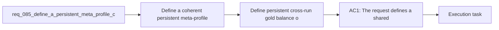

## item_320_define_persistent_cross_run_gold_balance_ownership_for_meta_progression_economy - Define persistent cross-run gold balance ownership for meta progression economy
> From version: 0.5.1
> Schema version: 1.0
> Status: Done
> Understanding: 97%
> Confidence: 95%
> Progress: 100%
> Complexity: Medium
> Theme: Meta progression
> Reminder: Update status/understanding/confidence/progress and linked task references when you edit this doc.

# Problem
- Define a coherent persistent meta-profile contract so the player keeps meaningful long-term progression between runs instead of restarting several meta surfaces from zero.
- Persist the long-term currency posture across runs, including the player's owned `gold` balance if gold is used as the first persistent economy for shop and talents.
- Persist `Bestiary` discovery and defeat progression across runs so creature knowledge remains cumulative.
- Persist `Grimoire` discovery progression across runs so skill and fusion archive knowledge remains cumulative.
- Prevent a split-brain progression model where the shop and talents remember long-term progression but codex surfaces or currency do not.
- The project now has several features that are beginning to imply a persistent account or profile layer:
- - shell-owned `Grimoire` and `Bestiary` archive surfaces

# Scope
- In:
- Out:

# Acceptance criteria
- AC1: The request defines a shared persistent meta-profile contract for cross-run progression rather than leaving gold, grimoire, and bestiary persistence implicit.
- AC2: The request defines that the player's long-term gold balance, or equivalent persistent economy value, is preserved across runs when used by meta-progression systems.
- AC3: The request defines that `Bestiary` discovery progression is cumulative across runs rather than tied only to the current run.
- AC4: The request defines that `Grimoire` discovery progression is cumulative across runs rather than tied only to the current run.
- AC5: The request clearly distinguishes persistent meta-profile data from the existing active run save-slot data.
- AC6: The request keeps the persistence model compatible with the current frontend-only and PWA-local storage posture.
- AC7: The request keeps `Bestiary` and `Grimoire` shell-owned as archive surfaces while making their underlying discovery state profile-persistent.
- AC8: The request defines validation expectations strong enough to later prove that:
- gold persists across reloads and run restarts
- bestiary entries discovered in one run remain discovered in later runs
- grimoire entries discovered in one run remain discovered in later runs
- run reset or defeat does not wipe the meta profile unintentionally

# AC Traceability
- AC1 -> Scope: The request defines a shared persistent meta-profile contract for cross-run progression rather than leaving gold, grimoire, and bestiary persistence implicit.. Proof: To be demonstrated during implementation validation.
- AC2 -> Scope: The request defines that the player's long-term gold balance, or equivalent persistent economy value, is preserved across runs when used by meta-progression systems.. Proof: To be demonstrated during implementation validation.
- AC3 -> Scope: The request defines that `Bestiary` discovery progression is cumulative across runs rather than tied only to the current run.. Proof: To be demonstrated during implementation validation.
- AC4 -> Scope: The request defines that `Grimoire` discovery progression is cumulative across runs rather than tied only to the current run.. Proof: To be demonstrated during implementation validation.
- AC5 -> Scope: The request clearly distinguishes persistent meta-profile data from the existing active run save-slot data.. Proof: To be demonstrated during implementation validation.
- AC6 -> Scope: The request keeps the persistence model compatible with the current frontend-only and PWA-local storage posture.. Proof: To be demonstrated during implementation validation.
- AC7 -> Scope: The request keeps `Bestiary` and `Grimoire` shell-owned as archive surfaces while making their underlying discovery state profile-persistent.. Proof: To be demonstrated during implementation validation.
- AC8 -> Scope: The request defines validation expectations strong enough to later prove that:. Proof: To be demonstrated during implementation validation.
- AC9 -> Scope: gold persists across reloads and run restarts. Proof: To be demonstrated during implementation validation.
- AC10 -> Scope: bestiary entries discovered in one run remain discovered in later runs. Proof: To be demonstrated during implementation validation.
- AC11 -> Scope: grimoire entries discovered in one run remain discovered in later runs. Proof: To be demonstrated during implementation validation.
- AC12 -> Scope: run reset or defeat does not wipe the meta profile unintentionally. Proof: To be demonstrated during implementation validation.

# Decision framing
- Product framing: Required
- Product signals: engagement loop, experience scope
- Product follow-up: Create or link a product brief before implementation moves deeper into delivery.
- Architecture framing: Required
- Architecture signals: data model and persistence, contracts and integration, runtime and boundaries, state and sync
- Architecture follow-up: Create or link an architecture decision before irreversible implementation work starts.

# Links
- Product brief(s): `prod_014_shell_codex_archive_direction_for_grimoire_and_bestiary`, `prod_015_post_run_outcome_analysis_direction_for_skill_performance`
- Architecture decision(s): `adr_016_define_shell_scene_state_and_meta_surface_ownership`, `adr_022_keep_product_meta_flow_shell_owned_while_runtime_state_remains_game_preserved`, `adr_045_model_grimoire_and_bestiary_as_shell_owned_discovery_gated_archive_scenes`
- Request: `req_085_define_a_persistent_meta_profile_contract_for_gold_bestiary_and_grimoire_progression_across_runs`
- Primary task(s): `task_059_orchestrate_second_wave_skills_fusion_completion_meta_progression_hourglass_pickup_and_game_over_damage_share_polish`

# Closure
- Proof: `src/app/model/metaProgression.ts`, `src/app/AppShell.tsx`, `src/shared/lib/metaProfileStorage.ts`.

# AI Context
- Summary: Define a persistent cross-run meta-profile contract for gold, bestiary progression, and grimoire progression.
- Keywords: meta profile, persistent, gold, bestiary, grimoire, cross run, archive, progression
- Use when: Use when framing scope, context, and acceptance checks for Define a persistent meta profile contract for gold bestiary and grimoire progression across runs.
- Skip when: Skip when the work targets another feature, repository, or workflow stage.

# References
- `logics/skills/logics-ui-steering/SKILL.md`

# Priority
- Impact:
- Urgency:

# Notes
- Derived from request `req_085_define_a_persistent_meta_profile_contract_for_gold_bestiary_and_grimoire_progression_across_runs`.
- Source file: `logics/request/req_085_define_a_persistent_meta_profile_contract_for_gold_bestiary_and_grimoire_progression_across_runs.md`.
- Request context seeded into this backlog item from `logics/request/req_085_define_a_persistent_meta_profile_contract_for_gold_bestiary_and_grimoire_progression_across_runs.md`.
