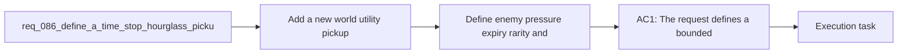

## item_326_define_enemy_pressure_expiry_rarity_and_non_stacking_safeguards_for_the_hourglass_effect - Define enemy pressure expiry rarity and non-stacking safeguards for the hourglass effect
> From version: 0.5.1
> Schema version: 1.0
> Status: Ready
> Understanding: 96%
> Confidence: 93%
> Progress: 0%
> Complexity: Medium
> Theme: Gameplay
> Reminder: Update status/understanding/confidence/progress and linked task references when you edit this doc.

# Problem
- Add a new world utility pickup in the same family as `gold`, `healing-kit`, and `magnet`, but centered on emergency control of enemy pressure rather than economy or healing.
- Introduce an `hourglass` pickup that stops enemy time for `3` seconds so the player gets a short but dramatic breathing window.
- Define that time stop suspends hostile movement and hostile ability to deal damage during the effect window.
- Keep the effect bounded and readable so it feels like a tactical rescue or momentum-reset pickup, not a broad simulation rewrite.
- The runtime already has:
- - utility pickups such as `gold`, `healing-kit`, and `magnet`

# Scope
- In:
- Out:

# Acceptance criteria
- AC1: The request defines a bounded new utility pickup wave introducing an `hourglass` pickup for enemy-pressure suspension rather than a broad stop-the-world system redesign.
- AC2: The request defines that collecting the `hourglass` suspends enemy movement for `3` seconds.
- AC3: The request defines that collecting the `hourglass` also suspends enemy ability to deal damage for the same `3` second window.
- AC4: The request defines the effect as bounded to hostile pressure and explicitly avoids turning it into a full global pause of player control, pickups, or the entire simulation.
- AC5: The request defines the `hourglass` as part of the utility-pickup family alongside `gold`, `healing-kit`, and `magnet`.
- AC6: The request defines the pickup as a high-impact but bounded utility reward, compatible with future tuning around rarity and spawn behavior.
- AC7: The request defines validation expectations strong enough to later prove that:
- hostile movement is halted during the effect window
- hostile contact damage or equivalent threat is disabled during the effect window
- the effect expires cleanly after `3` seconds
- the player remains able to move and interact during the stopped-time window

# AC Traceability
- AC1 -> Scope: The request defines a bounded new utility pickup wave introducing an `hourglass` pickup for enemy-pressure suspension rather than a broad stop-the-world system redesign.. Proof: To be demonstrated during implementation validation.
- AC2 -> Scope: The request defines that collecting the `hourglass` suspends enemy movement for `3` seconds.. Proof: To be demonstrated during implementation validation.
- AC3 -> Scope: The request defines that collecting the `hourglass` also suspends enemy ability to deal damage for the same `3` second window.. Proof: To be demonstrated during implementation validation.
- AC4 -> Scope: The request defines the effect as bounded to hostile pressure and explicitly avoids turning it into a full global pause of player control, pickups, or the entire simulation.. Proof: To be demonstrated during implementation validation.
- AC5 -> Scope: The request defines the `hourglass` as part of the utility-pickup family alongside `gold`, `healing-kit`, and `magnet`.. Proof: To be demonstrated during implementation validation.
- AC6 -> Scope: The request defines the pickup as a high-impact but bounded utility reward, compatible with future tuning around rarity and spawn behavior.. Proof: To be demonstrated during implementation validation.
- AC7 -> Scope: The request defines validation expectations strong enough to later prove that:. Proof: To be demonstrated during implementation validation.
- AC8 -> Scope: hostile movement is halted during the effect window. Proof: To be demonstrated during implementation validation.
- AC9 -> Scope: hostile contact damage or equivalent threat is disabled during the effect window. Proof: To be demonstrated during implementation validation.
- AC10 -> Scope: the effect expires cleanly after `3` seconds. Proof: To be demonstrated during implementation validation.
- AC11 -> Scope: the player remains able to move and interact during the stopped-time window. Proof: To be demonstrated during implementation validation.

# Decision framing
- Product framing: Not needed
- Product signals: (none detected)
- Product follow-up: No product brief follow-up is expected based on current signals.
- Architecture framing: Required
- Architecture signals: data model and persistence, contracts and integration
- Architecture follow-up: Create or link an architecture decision before irreversible implementation work starts.

# Links
- Product brief(s): `prod_016_time_owned_run_arc_and_authored_difficulty_phases`
- Architecture decision(s): `adr_033_adopt_deterministic_movement_oriented_pseudo_physics_instead_of_a_full_physics_engine`
- Request: `req_086_define_a_time_stop_hourglass_pickup_for_bounded_enemy_pressure_suspension`
- Primary task(s): (none yet)

# AI Context
- Summary: Define a time stop hourglass pickup for bounded enemy pressure suspension.
- Keywords: hourglass, time stop, pickup, enemy pressure, freeze, utility, gameplay
- Use when: Use when framing scope, context, and acceptance checks for Define a time stop hourglass pickup for bounded enemy pressure suspension.
- Skip when: Skip when the work targets another feature, repository, or workflow stage.

# Priority
- Impact:
- Urgency:

# Notes
- Derived from request `req_086_define_a_time_stop_hourglass_pickup_for_bounded_enemy_pressure_suspension`.
- Source file: `logics/request/req_086_define_a_time_stop_hourglass_pickup_for_bounded_enemy_pressure_suspension.md`.
- Request context seeded into this backlog item from `logics/request/req_086_define_a_time_stop_hourglass_pickup_for_bounded_enemy_pressure_suspension.md`.
