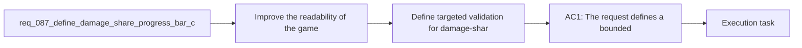

## item_330_define_targeted_validation_for_damage_share_fill_correctness_readability_and_low_value_row_safety - Define targeted validation for damage-share fill correctness readability and low-value row safety
> From version: 0.5.1
> Schema version: 1.0
> Status: Ready
> Understanding: 97%
> Confidence: 95%
> Progress: 0%
> Complexity: Low
> Theme: UI
> Reminder: Update status/understanding/confidence/progress and linked task references when you edit this doc.

# Problem
- Improve the readability of the `game over` skill-ranking list so players can compare skill contribution at a glance instead of reading only raw numbers.
- Represent each skill's share of total damage with a progress-bar style background directly inside the corresponding ranking row or damage cell.
- Keep the post-run analysis compact and legible while making relative contribution more immediately understandable.
- Preserve the current sorted-by-damage ordering while strengthening visual comparison between rows.
- The project already has a `game over` skill-ranking view that lists skills by damage contribution.
- That gives the player useful information, but the current read is still mostly numeric:

# Scope
- In:
- Out:

# Acceptance criteria
- AC1: The request defines a bounded UI polish wave for the existing `game over` skill-ranking rows rather than a broad outcome-analysis redesign.
- AC2: The request defines that each skill row, or its damage cell, includes a background progress-bar treatment.
- AC3: The request defines that the fill amount represents the skill's percentage share of total run damage.
- AC4: The request preserves the existing sorted-by-damage ranking posture rather than replacing it with a different ordering model.
- AC5: The request defines readability constraints so row text and numbers remain legible over the filled background.
- AC6: The request keeps the treatment scoped to the `game over` skill-ranking surface and does not widen it into a general charting system.
- AC7: The request defines validation expectations strong enough to later prove that:
- fill widths correspond to the correct damage percentages
- rows remain readable
- the highest-damage skill reads as the strongest visual bar
- zero or very low contribution rows still render safely without breaking layout

# AC Traceability
- AC1 -> Scope: The request defines a bounded UI polish wave for the existing `game over` skill-ranking rows rather than a broad outcome-analysis redesign.. Proof: To be demonstrated during implementation validation.
- AC2 -> Scope: The request defines that each skill row, or its damage cell, includes a background progress-bar treatment.. Proof: To be demonstrated during implementation validation.
- AC3 -> Scope: The request defines that the fill amount represents the skill's percentage share of total run damage.. Proof: To be demonstrated during implementation validation.
- AC4 -> Scope: The request preserves the existing sorted-by-damage ranking posture rather than replacing it with a different ordering model.. Proof: To be demonstrated during implementation validation.
- AC5 -> Scope: The request defines readability constraints so row text and numbers remain legible over the filled background.. Proof: To be demonstrated during implementation validation.
- AC6 -> Scope: The request keeps the treatment scoped to the `game over` skill-ranking surface and does not widen it into a general charting system.. Proof: To be demonstrated during implementation validation.
- AC7 -> Scope: The request defines validation expectations strong enough to later prove that:. Proof: To be demonstrated during implementation validation.
- AC8 -> Scope: fill widths correspond to the correct damage percentages. Proof: To be demonstrated during implementation validation.
- AC9 -> Scope: rows remain readable. Proof: To be demonstrated during implementation validation.
- AC10 -> Scope: the highest-damage skill reads as the strongest visual bar. Proof: To be demonstrated during implementation validation.
- AC11 -> Scope: zero or very low contribution rows still render safely without breaking layout. Proof: To be demonstrated during implementation validation.

# Decision framing
- Product framing: Consider
- Product signals: experience scope
- Product follow-up: Review whether a product brief is needed before scope becomes harder to change.
- Architecture framing: Consider
- Architecture signals: data model and persistence
- Architecture follow-up: Review whether an architecture decision is needed before implementation becomes harder to reverse.

# Links
- Product brief(s): `prod_015_post_run_outcome_analysis_direction_for_skill_performance`
- Architecture decision(s): `adr_046_expose_post_run_skill_performance_summaries_as_shell_consumable_outcome_data`
- Request: `req_087_define_damage_share_progress_bar_cells_for_game_over_skill_ranking_rows`
- Primary task(s): (none yet)

# AI Context
- Summary: Define a progress-bar background treatment for game-over skill ranking rows based on damage share.
- Keywords: game over, skill ranking, damage share, progress bar, outcome analysis, UI
- Use when: Use when framing scope, context, and acceptance checks for Define damage share progress bar cells for game over skill ranking rows.
- Skip when: Skip when the work targets another feature, repository, or workflow stage.

# References
- `logics/skills/logics-ui-steering/SKILL.md`

# Priority
- Impact:
- Urgency:

# Notes
- Derived from request `req_087_define_damage_share_progress_bar_cells_for_game_over_skill_ranking_rows`.
- Source file: `logics/request/req_087_define_damage_share_progress_bar_cells_for_game_over_skill_ranking_rows.md`.
- Request context seeded into this backlog item from `logics/request/req_087_define_damage_share_progress_bar_cells_for_game_over_skill_ranking_rows.md`.
