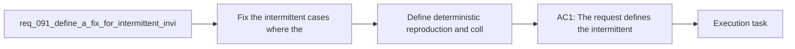

## item_331_define_deterministic_reproduction_and_collision_alignment_for_intermittent_invisible_wall_blocking_during_player_traversal - Define deterministic reproduction and collision alignment for intermittent invisible wall blocking during player traversal
> From version: 0.6.0
> Schema version: 1.0
> Status: Done
> Understanding: 100%
> Confidence: 96%
> Progress: 100%
> Complexity: Medium
> Theme: Gameplay
> Reminder: Update status/understanding/confidence/progress and linked task references when you edit this doc.

# Problem
- The player can sometimes be blocked while moving through terrain that looks visually normal, open, and non-blocking.
- This breaks trust in traversal because the blockage is not explained by a visible red blocker or other clear obstacle signal.
- The first delivery slice should capture one deterministic reproduction path, isolate the mismatch, and align collision behavior with what the player can actually see.

# Scope
- In: one or more deterministic reproduction scenarios for the false-blocking symptom, investigation of obstacle sampling and movement-resolution mismatch, and the smallest implementation change that removes the intermittent invisible-wall behavior.
- In: preserving intended blocking behavior for legitimate non-traversable obstacles.
- Out: obstacle recoloring, broad obstacle-density tuning, full physics rewrite, or unrelated world-generation redesign.

# Acceptance criteria
- AC1: The slice defines at least one deterministic reproduction path or bounded diagnostic scenario for the intermittent invisible-wall symptom.
- AC2: The slice defines and implements the smallest collision, traversal, or sampling alignment change needed so visually open and non-blocking terrain no longer stops player movement unexpectedly.
- AC3: The slice preserves legitimate obstacle blocking and does not regress the existing blocking-world contract.
- AC4: The slice stays bounded to player-traversal correctness and does not widen into a full physics, pathfinding, or world-generation redesign.

# AC Traceability
- AC1 -> Reproduction: a deterministic scenario now exists in test form by moving the player across the position of a hidden bootstrap support entity that previously acted as an invisible collider. Proof: `src/game/entities/model/entitySimulation.test.ts`.
- AC2 -> Alignment fix: hidden bootstrap support entities are no longer injected into movement collision or spawn-blocking checks when they are not part of the active simulation state. Proof: `games/emberwake/src/runtime/entitySimulation.ts`.
- AC3 -> Blocking safety: the obstacle-blocking contract remains unchanged and targeted traversal tests still pass after the fix. Proof: `games/emberwake/src/runtime/pseudoPhysics.test.ts`, `src/game/world/model/worldGeneration.test.ts`.
- AC4 -> Scope guard: the slice only removes hidden bootstrap support colliders from runtime traversal and spawn checks; it does not change world-generation, blocker rendering, or broad movement semantics. Proof: changed-file scope is limited to `games/emberwake/src/runtime/entitySimulation.ts` and `src/game/entities/model/entitySimulation.test.ts`.

# Decision framing
- Product framing: Not needed
- Product signals: (none detected)
- Product follow-up: No product brief follow-up is expected based on current signals.
- Architecture framing: Consider
- Architecture signals: data model and persistence
- Architecture follow-up: Review whether an architecture decision is needed before implementation becomes harder to reverse.

# Links
- Product brief(s): (none yet)
- Architecture decision(s): `adr_032_separate_visual_terrain_blocking_obstacles_and_movement_surface_modifiers`, `adr_033_adopt_deterministic_movement_oriented_pseudo_physics_instead_of_a_full_physics_engine`, `adr_035_resolve_entity_collisions_as_lightweight_deterministic_separation`
- Request: `req_091_define_a_fix_for_intermittent_invisible_wall_blocking_during_player_traversal`
- Primary task(s): `task_060_orchestrate_intermittent_invisible_wall_blocking_traversal_fix`

# AI Context
- Summary: Define a bounded fix for intermittent false blocking where the player appears to hit invisible walls during traversal.
- Keywords: invisible wall, traversal, collision, obstacle, blocking, player movement, false positive
- Use when: Use when framing scope, context, and acceptance checks for an intermittent player-traversal blocking bug.
- Skip when: Skip when the work targets another feature, repository, or workflow stage.

# Priority
- Impact: High
- Urgency: High

# Notes
- Derived from request `req_091_define_a_fix_for_intermittent_invisible_wall_blocking_during_player_traversal`.
- Source file: `logics/request/req_091_define_a_fix_for_intermittent_invisible_wall_blocking_during_player_traversal.md`.
- Request context seeded into this backlog item from `logics/request/req_091_define_a_fix_for_intermittent_invisible_wall_blocking_during_player_traversal.md`.
- Delivered through `games/emberwake/src/runtime/entitySimulation.ts` by removing hidden deterministic runtime support entities from player-collision and spawn-blocking checks.
