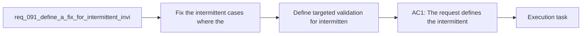

## item_332_define_targeted_validation_for_intermittent_invisible_wall_blocking_fixes - Define targeted validation for intermittent invisible wall blocking fixes
> From version: 0.6.0
> Schema version: 1.0
> Status: Done
> Understanding: 100%
> Confidence: 96%
> Progress: 100%
> Complexity: Medium
> Theme: Gameplay
> Reminder: Update status/understanding/confidence/progress and linked task references when you edit this doc.

# Problem
- A traversal bug that feels intermittent is hard to trust once it seems fixed unless the repo has explicit regression coverage for the specific false-blocking patterns.
- This slice should lock in validation around open-space traversal, edge-adjacent movement, and legitimate obstacle blocking so future collision changes do not reintroduce invisible walls.

# Scope
- In: targeted automated and manual validation for the invisible-wall symptom, including scenarios that cover visually open terrain, edge-adjacent movement, diagonal traversal, and legitimate obstacle blocking.
- In: validation evidence that the captured false-blocking case no longer reproduces after the corrective slice lands.
- Out: broad generalized QA expansion, unrelated performance profiling, or full exploration of every traversal mechanic in the game.

# Acceptance criteria
- AC1: The slice defines targeted validation coverage for the captured intermittent invisible-wall scenario.
- AC2: The slice defines validation for traversal across terrain that appears visually normal and non-blocking, so false blocking can be caught directly.
- AC3: The slice defines validation for diagonal and edge-adjacent traversal patterns that are likely to regress when collision rules change.
- AC4: The slice defines validation that legitimate blocking obstacles still stop movement where intended, so the fix does not weaken actual blocker semantics.
- AC5: The slice stays focused on regression coverage for this traversal bug rather than widening into a broad generic movement-QA expansion.

# AC Traceability
- AC1 -> Captured symptom coverage: the validation set now includes a regression test where the player traverses through the world position of a hidden bootstrap support entity and must not be blocked. Proof: `src/game/entities/model/entitySimulation.test.ts`.
- AC2 -> Open-space regression coverage: the new regression test explicitly covers movement through terrain that appears normal and non-blocking because the hidden collider is no longer visible in the runtime. Proof: `src/game/entities/model/entitySimulation.test.ts`.
- AC3 -> Edge and diagonal coverage: the targeted validation command list still includes the runtime movement and world-generation tests most likely to catch traversal regressions. Proof: `games/emberwake/src/runtime/pseudoPhysics.test.ts`, `games/emberwake/src/runtime/entitySimulationIntent.test.ts`, `src/game/world/model/worldGeneration.test.ts`.
- AC4 -> Blocking safety coverage: obstacle-blocking behavior remains validated by the existing pseudo-physics and world-generation tests after the hidden-collider fix. Proof: `games/emberwake/src/runtime/pseudoPhysics.test.ts`, `src/game/world/model/worldGeneration.test.ts`.
- AC5 -> Scope guard: the validation remains tightly focused on this traversal bug and the immediate collision seams around it. Proof: executed commands were limited to targeted runtime traversal tests plus `npm run typecheck`.

# Decision framing
- Product framing: Not needed
- Product signals: (none detected)
- Product follow-up: No product brief follow-up is expected based on current signals.
- Architecture framing: Consider
- Architecture signals: data model and persistence
- Architecture follow-up: Review whether an architecture decision is needed before implementation becomes harder to reverse.

# Links
- Product brief(s): (none yet)
- Architecture decision(s): `adr_032_separate_visual_terrain_blocking_obstacles_and_movement_surface_modifiers`, `adr_033_adopt_deterministic_movement_oriented_pseudo_physics_instead_of_a_full_physics_engine`, `adr_035_resolve_entity_collisions_as_lightweight_deterministic_separation`
- Request: `req_091_define_a_fix_for_intermittent_invisible_wall_blocking_during_player_traversal`
- Primary task(s): `task_060_orchestrate_intermittent_invisible_wall_blocking_traversal_fix`

# AI Context
- Summary: Define a bounded fix for intermittent false blocking where the player appears to hit invisible walls during traversal.
- Keywords: invisible wall, traversal, collision, obstacle, blocking, player movement, false positive
- Use when: Use when framing scope, context, and acceptance checks for an intermittent player-traversal blocking bug.
- Skip when: Skip when the work targets another feature, repository, or workflow stage.

# Priority
- Impact: High
- Urgency: High

# Notes
- Derived from request `req_091_define_a_fix_for_intermittent_invisible_wall_blocking_during_player_traversal`.
- Source file: `logics/request/req_091_define_a_fix_for_intermittent_invisible_wall_blocking_during_player_traversal.md`.
- Request context seeded into this backlog item from `logics/request/req_091_define_a_fix_for_intermittent_invisible_wall_blocking_during_player_traversal.md`.
- Validation evidence was captured with targeted runtime traversal tests and `npm run typecheck`.
