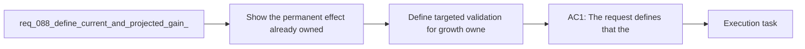

## item_334_define_targeted_validation_for_growth_owned_and_projected_gain_visibility - Define targeted validation for growth owned and projected gain visibility
> From version: 0.6.0
> Schema version: 1.0
> Status: Done
> Understanding: 100%
> Confidence: 97%
> Progress: 100%
> Complexity: Low
> Theme: Meta progression
> Reminder: Update status/understanding/confidence/progress and linked task references when you edit this doc.

# Problem
- Show the permanent effect already owned on the `Growth` screen instead of exposing only rank and price.
- Show the projected benefit of the next purchase before the player spends gold.
- Expose owned completion as a percentage where the lane has a bounded denominator, so progression is readable at a glance.
- Keep this slice presentation-only and aligned with the existing meta-progression rules.
- The current `Growth` scene already covers core purchase flow, but it does not explain the value of a purchase clearly enough:
- - the `Shop` lane shows a raw ownership count such as `1/3 owned`

# Scope
- In:
- Out:

# Acceptance criteria
- AC1: The request defines that the `Growth` screen shows the current owned effect for each talent rather than only the current rank and next price.
- AC2: The request defines that percentage-based talents show the currently owned bonus and the next projected gain in percentage terms before purchase.
- AC3: The request defines that fixed-value talents such as health or shield gains keep honest unit-based presentation rather than fabricated percentages.
- AC4: The request defines that bounded ownership summaries expose owned progress as a percentage where a clear denominator exists, at minimum for `Shop` ownership.
- AC5: The request defines that displayed owned and projected values are derived from the same meta-progression rules currently used to apply runtime modifiers.
- AC6: The request keeps the slice presentation-only and does not change costs, rank caps, unlock ownership rules, or persistence behavior.
- AC7: The request defines validation expectations strong enough to later prove that:
- current owned values match the active talent ranks
- projected next values match the next purchasable rank
- capped talents do not show misleading projected-gain copy
- owned percentages stay aligned with actual purchased ownership counts after a purchase

# AC Traceability
- AC1 -> Scope: rendered growth cards now expose current owned effects and the validation suite asserts those strings are present. Proof: `src/app/components/AppMetaScenePanel.test.tsx`.
- AC2 -> Scope: percentage-based previews are covered through model-level assertions and rendered-card assertions. Proof: `src/app/model/metaProgression.test.ts`, `src/app/components/AppMetaScenePanel.test.tsx`.
- AC3 -> Scope: fixed-value previews remain unit-based and are asserted directly in model tests and the rendered growth scene. Proof: `src/app/model/metaProgression.test.ts`, `src/app/components/AppMetaScenePanel.test.tsx`.
- AC4 -> Scope: shop ownership percentage coverage is asserted through the shared helper and the rendered `Shop` header. Proof: `src/app/model/metaProgression.test.ts`, `src/app/components/AppMetaScenePanel.test.tsx`.
- AC5 -> Scope: validation exercises the helper built on top of runtime-derived meta modifiers rather than duplicating isolated literals. Proof: `src/app/model/metaProgression.ts`, `src/app/model/metaProgression.test.ts`.
- AC6 -> Scope: validation stayed presentation-focused and did not widen into progression-rule changes. Proof: executed commands were limited to model/UI tests plus `npm run typecheck`.
- AC7 -> Scope: the validation set proves the intended display posture end to end. Proof: `npm run test -- src/app/model/metaProgression.test.ts src/app/components/AppMetaScenePanel.test.tsx src/app/components/ShellMenu.test.tsx games/emberwake/src/runtime/buildSystem.test.ts`.
- AC8 -> Scope: current owned values match active ranks. Proof: `src/app/model/metaProgression.test.ts`, `src/app/components/AppMetaScenePanel.test.tsx`.
- AC9 -> Scope: projected next values match the next rank. Proof: `src/app/model/metaProgression.test.ts`, `src/app/components/AppMetaScenePanel.test.tsx`.
- AC10 -> Scope: capped-state rendering avoids misleading projected gain copy. Proof: `src/app/components/GrowthScene.tsx`.
- AC11 -> Scope: owned-percentage rendering remains aligned with purchased unlock counts. Proof: `src/app/model/metaProgression.test.ts`, `src/app/components/AppMetaScenePanel.test.tsx`.

# Decision framing
- Product framing: Not needed
- Product signals: (none detected)
- Product follow-up: No product brief follow-up is expected based on current signals.
- Architecture framing: Consider
- Architecture signals: data model and persistence
- Architecture follow-up: Review whether an architecture decision is needed before implementation becomes harder to reverse.

# Links
- Product brief(s): (none yet)
- Architecture decision(s): (none yet)
- Request: `req_088_define_current_and_projected_gain_visibility_on_the_growth_screen`
- Primary task(s): `task_061_orchestrate_growth_owned_and_projected_gain_visibility`

# AI Context
- Summary: Define clearer owned bonus and next purchase gain visibility on the shell-owned Growth screen.
- Keywords: growth, talents, owned bonus, projected gain, percentage, shop progress, meta progression
- Use when: Use when framing scope, context, and acceptance checks for clearer owned and projected progression visibility on the Growth screen.
- Skip when: Skip when the work targets another feature, repository, or workflow stage.

# References
- `logics/skills/logics-ui-steering/SKILL.md`

# Priority
- Impact:
- Urgency:

# Notes
- Derived from request `req_088_define_current_and_projected_gain_visibility_on_the_growth_screen`.
- Source file: `logics/request/req_088_define_current_and_projected_gain_visibility_on_the_growth_screen.md`.
- Request context seeded into this backlog item from `logics/request/req_088_define_current_and_projected_gain_visibility_on_the_growth_screen.md`.
