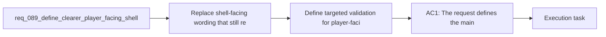

## item_336_define_targeted_validation_for_player_facing_shell_label_consistency_across_shell_surfaces - Define targeted validation for player-facing shell label consistency across shell surfaces
> From version: 0.6.0
> Schema version: 1.0
> Status: Done
> Understanding: 100%
> Confidence: 97%
> Progress: 100%
> Complexity: Low
> Theme: UI
> Reminder: Update status/understanding/confidence/progress and linked task references when you edit this doc.

# Problem
- Replace shell-facing wording that still reads like internal UI labels with clearer player-facing labels.
- Rename the main shell title from `Main menu` to `Emberwake`.
- Rename the eyebrow or scene-family label from `Shell entry` to `Main menu`.
- Rename `Grimoire` to a more immediately readable skills-facing term, with `Skills` as the default direction.
- Rename `Growth` to a more immediately readable talents-facing term, with `Talents` as the default direction.
- The shell currently uses several labels that are technically coherent but not equally strong from a player-facing naming standpoint:
- - the main shell title reads `Main menu`

# Scope
- In:
- Out:

# Acceptance criteria
- AC1: The request defines the main shell title label as `Emberwake` instead of `Main menu`.
- AC2: The request defines the shell eyebrow or equivalent supporting label as `Main menu` instead of `Shell entry`.
- AC3: The request defines that the player-facing label currently shown as `Grimoire` is replaced by a clearer skills-facing label, with `Skills` as the recommended default.
- AC4: The request defines that the player-facing label currently shown as `Growth` is replaced by a clearer talents-facing label, with `Talents` as the recommended default.
- AC5: The request keeps the change bounded to visible shell copy and does not require renaming internal scene identifiers, component names, or persistence contracts.
- AC6: The request defines validation expectations strong enough to later prove that the updated labels are applied consistently across the main shell header, menu entries, action buttons, and scene titles where those surfaces currently expose the old wording.

# AC Traceability
- AC1 -> Scope: tests assert the main shell title now renders as `Emberwake`. Proof: `src/app/components/AppMetaScenePanel.test.tsx`, `src/app/components/ShellMenu.test.tsx`.
- AC2 -> Scope: tests and component copy assert the shell-level `Main menu` label replaces the old supporting wording. Proof: `src/app/components/AppMetaScenePanel.tsx`, `src/app/components/ShellMenu.test.tsx`.
- AC3 -> Scope: the validation suite asserts `Skills` appears in player-facing entry points where `Grimoire` previously appeared. Proof: `src/app/components/AppMetaScenePanel.test.tsx`.
- AC4 -> Scope: the validation suite asserts `Talents` appears in player-facing entry points where `Growth` previously appeared. Proof: `src/app/components/AppMetaScenePanel.test.tsx`, `src/app/components/ShellMenu.test.tsx`.
- AC5 -> Scope: validation stayed focused on visible-copy consistency and did not require deeper routing or persistence changes. Proof: executed commands were limited to shell component tests plus `npm run typecheck`.
- AC6 -> Scope: renamed labels are covered across the main shell header, action buttons, and shell menu context surfaces. Proof: `npm run test -- src/app/model/metaProgression.test.ts src/app/components/AppMetaScenePanel.test.tsx src/app/components/ShellMenu.test.tsx games/emberwake/src/runtime/buildSystem.test.ts`.

# Decision framing
- Product framing: Consider
- Product signals: navigation and discoverability
- Product follow-up: Review whether a product brief is needed before scope becomes harder to change.
- Architecture framing: Consider
- Architecture signals: data model and persistence
- Architecture follow-up: Review whether an architecture decision is needed before implementation becomes harder to reverse.

# Links
- Product brief(s): (none yet)
- Architecture decision(s): (none yet)
- Request: `req_089_define_clearer_player_facing_shell_labels_for_the_main_menu_skills_and_talents_surfaces`
- Primary task(s): `task_062_orchestrate_shell_label_renaming_for_emberwake_skills_and_talents_surfaces`

# AI Context
- Summary: Define clearer player-facing shell wording for the front-door title, main-menu eyebrow, skills archive label, and talents progression label.
- Keywords: emberwake, main menu, shell entry, grimoire, growth, skills, talents, copy
- Use when: Use when framing scope, context, and acceptance checks for a bounded shell-label renaming wave.
- Skip when: Skip when the work targets another feature, repository, or workflow stage.

# References
- `logics/skills/logics-ui-steering/SKILL.md`

# Priority
- Impact:
- Urgency:

# Notes
- Derived from request `req_089_define_clearer_player_facing_shell_labels_for_the_main_menu_skills_and_talents_surfaces`.
- Source file: `logics/request/req_089_define_clearer_player_facing_shell_labels_for_the_main_menu_skills_and_talents_surfaces.md`.
- Request context seeded into this backlog item from `logics/request/req_089_define_clearer_player_facing_shell_labels_for_the_main_menu_skills_and_talents_surfaces.md`.
